Selenium Test Framework Nedir?
==============================

Selenium otomatize edilmiş bir şekilde web projelerinizi fonksiyonel olarak test
edebileceğiniz bir Test Framework’ü olarak bilinir. Selenium ile Chrome’dan
Internet Explorer’a kadar hemen hemen tüm tarayıcılar için ister tarayıcıların
desteklediği uzantılar ile isterseniz masaüstü uygulaması ile isterseniz de
sizin seçtiğiniz bir programlama dili ile kolayca sayfalarınızı veya her hangi
bir internet sayfasını test edebilirsiniz. Peki nasıl mı?


Selenium ile Nasıl Test Yapılır?
================================

Bu yazıda sizler Selenium ile kod üzerinden yapacağımız bir örnek ile
karşılaşacaksınız ve POM(Page Object Model) dediğimiz modelleme ile Selenium ile
yazacağımız testleri Java ortamında JUnit Test Framework yardımıyla yazıyor
olacağız.

Uzun lafın kısası ihtiyacımız olanlar aşağıdaki tablodadır.

| Java için:                                                     | C\# için:                                                      |
|----------------------------------------------------------------|----------------------------------------------------------------|
| Selenium WebDriver Kütüphanesi                                 | Selenium WebDriver Kütüphanesi                                 |
| JUnit                                                          | NUnit                                                          |
| Test etmek istediğiniz Tarayıcı için ilgili Driver Kütüphanesi | Test etmek istediğiniz Tarayıcı için ilgili Driver Kütüphanesi |

Adım adım Teste Doğru
---------------------

1.  Driverları indirelim:

<https://www.seleniumhq.org/download/> sitesine girip,


Kısmından geliştirmek istediğiniz dile uygun paketleri indirerek devam
edelim. Ben yukarıdaki ekran görüntüsünün üstünde yer alan Selenium
Standalone Server 3.13.0 versiyonunu indirip kullanıyor olacağım.


1.  Yok ise JUnit indirelim biz bu projemizde JUnit 4 kullanıyor olacağız.

    -   <https://github.com/junit-team/junit4/wiki/Download-and-Install>
        adresinden ilgili adımları takip edip indirebilir ve eclipse içinde
        bulunan plugins dosyası içine dahil edebilirsiniz.

2.  Testlerinizin çalışmasını istediğiniz Tarayıcının sürücüsünü(driver)
    indirelim ve çalıştıralım bu projede Chrome ile çalışıyor olacağımız için
    <http://chromedriver.chromium.org/downloads> bu linkten
    "Chrome_driver.exe" tarzında adı olan exe dosyasını sisteminize uygun olan
    versiyonunu indirip exe’yi çalıştırın ve tamamdır.

3. Şimdi yeni bir Java projesi oluşturalım.


Buraya kadar farklı bi işlem yapmadık altı üstü Eclipse üzerinde yeni bir
java projesi açtık. Şimdi olay buradan sonra başlıyor. Yukarıdaki ekrandan
sonra Next tuşuna basınca karşımıza gelen ekranda "Libraries" sekmesine
giriyoruz ve Add Library deyip JUnit kütüphanesini projemize dahil ediyoruz.


Her şey hazır olduğuna göre artık Finish deyip projemiz üzerinde çalışmaya
başlayabiliriz.

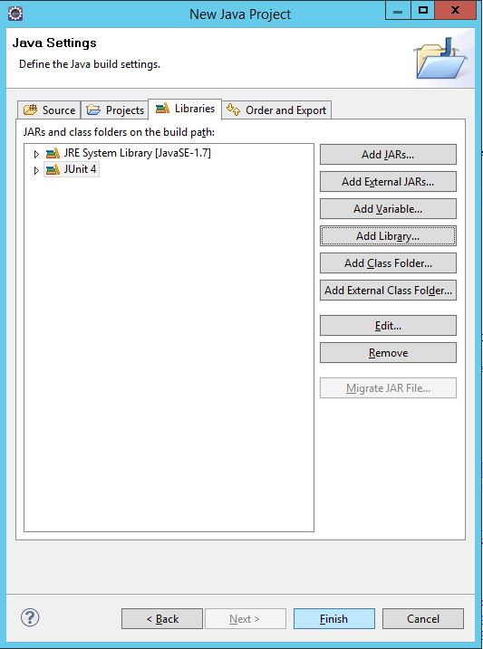

Finish dedikten sonra Eclipse size "Bu kütüphane arayüzünüzde değişiklikler
yapacaktır." diye bir uyarı veriyor. Onayladıktan sonra projeniz Solution
Ekranında tahmini bu şekilde başlayacaktır.

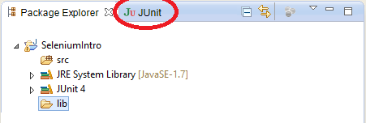

Kırmızı daire içine alınan yer ise Eclipse’nin sizi uyardığı arayüzü
bulunduran JUnit’e ait test sonuçlarını ve durumlarını izleyebildiğiniz
ekrandır.

Seçili olarak gördüğünüz lib dosyasını özel olarak kendimiz oluşturuyoruz
yani projeniz açıldığı zaman çok büyük ihtimalle öyle bir dosyaya sahip
olmayacaksınız. O yüzden projeye bir lib dosyası ekleyelim. Bu dosyanın
içine de indirdiğimiz .jar dosyalarını atalım.


Eklediğiniz dosyaları görmek için lib klasörü üzerine sağ klik -\> Refresh
yaparsanız dosyanız gelecektir.

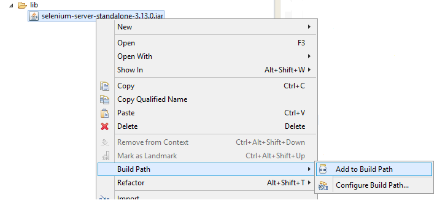

İşlemini yaptıktan sonra Selenium kütüphanesinide projenize dahil etmiş
oldunuz. Dosyalarınız ve projenizin görüntüsü yaklaşık olarak şöyle olması
beklenmektedir:

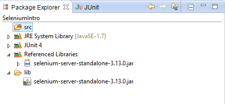

Artık istediğiniz gibi testlerinizi yazabilirsiniz ama nasıl?

Kolay Bir Başlangıç
-------------------

Selenium ve oalyları anlamak adına basit bir başlangıç yapalım ve TestMain
adında Main fonksiyonu bulunduran bir sınıf oluşturalım.

Main metodumuzun hemen üstüne WebDriver’ımızı, ChromeDriver’ımızı ve onun exe
pathini ve Driver’ımızı bekletmemizi sağlayacak Wait alanlarımızı tanımlayalım :


```Java
TestMain.java
--------------------------
package basics; 
import java.io.File; 
import org.openqa.selenium.WebDriver; 
import org.openqa.selenium.chrome.ChromeDriverService; 
import org.openqa.selenium.remote.DesiredCapabilities; 
import org.openqa.selenium.remote.RemoteWebDriver; 
import org.openqa.selenium.support.ui.WebDriverWait; 
public class TestMain { 

    // İndirdiğimiz Chrome_driver.exe’mizin dizini 
    protected static String ChromePath = 
                    "C:\\\\Users\\\\User\\\\Downloads\\\\
                        WebDrivers\\\\Chrome\\\\
                        chromedriver_win32\\\\chromedriver.exe"; 

    // Chrome Sürücülerinize ulaşmamızı sağlayan servis 
    protected static ChromeDriverService service; 

    // Asıl sürücünüz ve Selenium bize sağladığı en büyük nimet olan 
    // bulunduğumuz internet sayfasındaki elemanara(elementlere) 
    // ulaştığımız ve taracıyı kontrol ettiğimiz arkadaş 
    protected static WebDriver driver; 

    // Bizim için sürücümüzü bekletecek özellik(opsiyonel) 
    protected static WebDriverWait wait; 

    // Main fonksiyonumuz 
    public static void main(String[] args) { } 
    } 
} 
```

Bu noktadan sonra Main fonksiyonu içinde bu değişkenleri kullanmadan önce
onların kurulumlarını yapacağımız bir Setup() metodu oluşturup ilk atamalarını
gerçekleştirelim.

```Java
public static void Setup(){ 
    // Chrome_driver.exe dizininden servisi oluştur ve başlat 
    service = new ChromeDriverService.Builder().usingDriverExecutable(new File(ChromePath)).usingAnyFreePort().build(); 
    try { 
        service.start(); 
    } catch (Exception e) { 
        e.printStackTrace(); 
    } 
    System.setProperty("webdriver.chrome.driver", ChromePath); 
    // Driver nesnesini service bilgilerini kullanarak oluştur 
    driver = new RemoteWebDriver(service.getUrl(),DesiredCapabilities.chrome()); 
    
    // Bütün sayfaları açarken 15ms bekle 
    wait = new WebDriverWait(driver,15); 
    
    // Pencereyi Büyüt 
    driver.manage().window().maximize(); 
} 
```
Bu metotta yukarıdakiler gibi **TestMain.java** dosyasının içerisinde bulunup
main fonksiyonun altında yer alacaktır.

Bi Setup var bir şeyleri başlatıyoruz iyi hoş birde bu servisleri ve sürücüleri
işlerimizi bitirdiğimiz zaman kapatmak için bir **Stop()** metodu da yazalım
madem tam olsun.

```Java
public static void Stop(){
    service.stop(); 
    driver.quit(); 
} 
```

Sıra artık Main fonksiyonumuz içerisinde driver ile chrome üzerinde arama
yaparak başlayalım devamında sonuçlardan sayfalara erişip değerler almakla veya
basit aksiyonlarla ilgili olacaktır.
------------------

### Google üzerinde arama yapmak:

Main metodumuzu aşağıdaki şekilde doldururusak Chrome’un otomatik olarak açılıp
ilgili alanlara ilgili işlemleri yaptığını göreceksiniz .

```Java
public static void main(String[] args) { 
    Setup(); 
    // Google sayfasını Açar 
    driver.get("https://www.google.com/"); 
    
    // Arama kutusunun bilgilerini getirir ve bunu yaparken id'sini 
    // kullanarak erişir 
    WebElement txtSearch = driver.findElement(By.id("lst-ib")); 
    
    // Ara butonuna "name" özelliği üzerinden erişir 
    WebElement btnSearch = driver.findElement(By.name("btnK")); 
    
    // Arama kutusuna aranacak değerleri gönder 
    txtSearch.sendKeys("Oyak-Renault Bursa"); 
    
    // Arama Butonuna bas 
    btnSearch.click(); 
    
    // Veya Enter tuşuna bas 
    // txtSearch.sendKeys(Keys.ENTER); 
    
    Stop(); 
}
```
By.id , By.name, By.cssSelector gibi seçiciler diğer elementlere ulaşma
tiplerine nazaran Selenium alt yapısında çok iyi hazırlandıkları ve köklü
oldukları için daha hızlı yanıt verirler. Hatta bazen o kadar hızlı yanıt
verirler ki sonraki adıma geçilene kadar bazı aksiyonlar ve animasyonlar
gerçekleştiği için sayfada elementlerin değiştiği durumlarda bu durumları
"handle" edemezler. Bu tarz sorunlarda Seleniumun hızını kesmek için tabiri
caizse ayağına "**Thread.sleep(500); (1000,2000)**" gibi satırlarla taş bağlarız
ki adımları atlamasın ya da sorun çıkmasın diye.

### Googledan ulaşılan sayfa hakkında bilgi edinmek ve JUnit ile test etmek:

Şimdi işleri biraz daha ilginçleştirelim butonu şimdilik devreden çıkaralım
normal bir insanmışcasına ‘’Enter’’ tuşu ile arama yaptırıp çıkan sonuçlardan
birisini seçip devam edelim ve girdiğimiz sayfanın linki ile olmasını
istediğimiz linki JUnit kullanarak karşılaştıralım.

```Java
public static void main(String[] args) {
    Setup(); 
    // Google sayfasını Açar 
    driver.get("https://www.google.com/"); 
    
    // Arama kutusunun bilgilerini getirir ve bunu yaparken "id"sini 
    // kullanarak erişir 
    WebElement txtSearch = driver.findElement(By.id("lst-ib")); 
    
    // Ara butonuna "name" özelliği üzerinden erişir 
    WebElement btnSearch = driver.findElement(By.name("btnK")); 
    
    // Arama kutusuna aranacak değerleri gönder 
    txtSearch.sendKeys("Oyak-Renault Bursa"); 
    
    // Enter tuşuna bas 
    txtSearch.sendKeys(Keys.ENTER); 
    
    // Arama sonuç listesi içindeki başlıkları getir 
    List<WebElement> resultTitles = driver.findElements(By.className("r")); 
    
    // Başlıklardan istenilene tıkla 
    resultTitles.get(1).click(); 
    
    // Driver’ın yönlendiği adresi getir ve eldeki address ile aynı 
    // olup olmadığını JUnit kütüphanesindeki varsayım metoduyla 
    // kontrol et 
    assertEquals(driver.agetCurrtenUrl(),"<http://www.oyak-renault.com>"); 
    
    Stop(); 
}
```

İşte gördüğünüz gibi Selenium ve JUnit ile test yapmak Chrome, IE, Firefox gibi
tarayıcılarda web projelerinizi ve fonksiyonel yönlerini kontrol etmek işte bu
kadar basit buradan sonrası sizlerin yaratıcılığına kalıyor, ihtiyaçlarına
kalıyor. Son olarak TestMain.java dosyamız aşağıdaki gibi gözükmektedir.

```Java
| TestMain.java
----------------------------------------
package basics;
import java.io.File; 
import java.util.List; 
import static org.junit.Assert.*; 
import org.openqa.selenium.By; 
import org.openqa.selenium.Keys; 
import org.openqa.selenium.WebDriver; 
import org.openqa.selenium.WebElement; 
import org.openqa.selenium.chrome.ChromeDriverService; 
import org.openqa.selenium.remote.DesiredCapabilities; 
import org.openqa.selenium.remote.RemoteWebDriver; 
import org.openqa.selenium.support.ui.WebDriverWait; 
public class TestMain { 
    // Chrome_driver.exe'nin dizini
    protected static String ChromePath = "C:\\\\Users\\\\at03178\\\\Downloads\\\\WebDrivers\\\\Chrome\\\\chromedriver_win32\\\\chromedriver.exe"; 
    
    // Chrome kullandığımız Chrome servisi 
    protected static ChromeDriverService service; 
    
    // Web Elemanlarına ulaşmak istediğimizde bize yardım edecek sürücünün tanımlanması
    protected static WebDriver driver; 
    
    // Sürücüyü bekleten sürücü özelliği 
    protected static WebDriverWait wait; 
    
    public static void main(String[] args){ 
        Setup(); 
        // Google sayfasını Açar 
        driver.get("https://www.google.com/"); 
        
        // Arama kutusunun bilgilerini getirir ve bunu yaparken “id”sini 
        // kullanarak erişir 
        WebElement txtSearch = driver.findElement(By.id("lst-ib")); 
        
        // Arama kutusuna aranacak değerleri gönder 
        txtSearch.sendKeys("Oyak-Renault Bursa"); 
        
        // Enter tuşuna bas 
        txtSearch.sendKeys(Keys.ENTER); 

        // Arama sonuç listesi içindeki başlıkları getir 
        List<WebElement> resultTitles = driver.findElements(By.className("r")); 
        
        // Başlıklardan istenilene tıkla 
        resultTitles.get(1).click(); 
        
        // Driver’ın yönlendiği adresi getir ve eldeki address ile aynı 
        // olup olmadığını JUnit kütüphanesindeki varsayım metoduyla 
        // kontrol et 
        assertEquals(driver.agetCurrtenUrl(),"<https://www.oyak-renault.com>"); 
    } 
    
    public static void Setup(){ 
        service = new ChromeDriverService.Builder().usingDriverExecutable(new File(ChromePath)).usingAnyFreePort().build(); 
        try { 
            service.start();
        } catch (Exception e) { 
            e.printStackTrace(); 
        } 
        
        System.setProperty("webdriver.chrome.driver", ChromePath); driver = new RemoteWebDriver(service.getUrl(),DesiredCapabilities.chrome()); 
        
        // Tüm sayfalarda 15 saniye bekler
        wait =**new WebDriverWait(driver,15); 

        // Pnecereyi büyütür 
        driver.manage().window().maximize(); 
    } 
    
    public static void Stop(){ 
        driver.quit(); 
        service.stop(); 
    } 
}
```


POM(Project Object Model) ile Test Etmek
----------------------------------------

Aslına bakarsanız yukarıda yaptıklarımızdan hiç bir farkı yok ve olayın tek
farkı işleri daha nesneye yönelik (Object Oriented) bir hale getirip hem kodun
okunabilirliğini hem de JUnit tarafında daha kontrol edilebilir bir hale
getirmektir.

**Peki nasıl?**

Öncelikle sayfalarınız ve testleriniz için ayrı birer package oluşturalım.

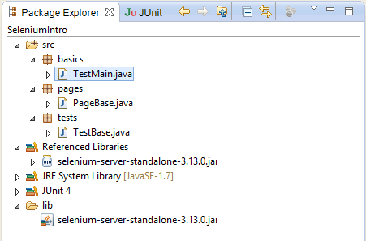

### Pages Paketi:

Bu paket içerisinde sayfalarımız ve sayfalarımızda bulunan Elementlere
ulaştığımız sayfalara ait spesifik elementlerin tanımları ve fonksiyonel olarak
gerçekleştirilecek işlemlere ait metotlar bulunur. Bu metotlara yardımcı olması
ve kolaylaştırması için PageBase adında abstract bir super sınıf bulunmaktadır.

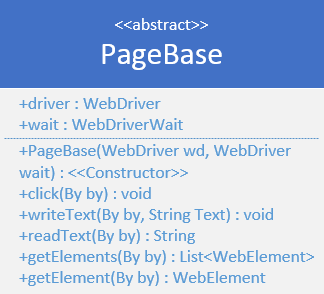

```Java
PageBase.java
--------------------
package pages; 
import java.util.List; 
import org.openqa.selenium.By; 
import org.openqa.selenium.WebDriver; 
import org.openqa.selenium.WebElement; 
import org.openqa.selenium.support.ui.WebDriverWait; 
public abstract class PageBase { 
    public WebDriver driver; 
    public WebDriverWait wait; 
    
    //Constructor 
    public PageBase (WebDriver driver, WebDriverWait wait){ 
        this.driver = driver; 
        this.wait = wait; 
    }

    //Click Method 
    public void click (By elementLocation) { 
        driver.findElement(elementLocation).click(); 
    } 

    //Write Text 
    public void writeText (By elementLocation, String text) { 
        driver.findElement(elementLocation).clear(); 
        driver.findElement(elementLocation).sendKeys(text); 
    }
    
    //Read Text 
    public String readText (By elementLocation) {
        return driver.findElement(elementLocation).getText(); 
    } 
    
    //Get List Of Elements 
    public List<WebElement> getElements(By elementLocation){
        return driver.findElements(elementLocation); 
    } 
    
    //Get Element 
    public WebElement getElement(By elementLocation){
        return driver.findElement(elementLocation); 
    } 
}
```

PageBase sınıfımızı tanımladıktan sonra şimdi basit bir şekilde ana sayfa ve
giriş sayfalarımızda test etmek istediğimiz fonksiyonları bulunduran ve PageBase
sınıfını kalıtan iki sınıf daha oluşturalım.

```Java
HomePage.java
-------------
package pages; 
import org.openqa.selenium.By; 
import org.openqa.selenium.WebDriver; 
import org.openqa.selenium.support.ui.WebDriverWait; 
public class HomePage extends PageBase{ 
    // Consturctor 
    public HomePage(WebDriver driver, WebDriverWait wait) { 
        super(driver, wait); 
        driver.get("https://www.google.com/"); 
    } 
    
    // WebElements 
    public String btnMenuApps = "gbwa"; 
    
    // id 
    public String btnMenuMaps = "gb8"; 
    
    // id 
    public String btnMenuLogIn = "gb_70";
    
    // id 
    // This method will use in test class 
    public String checkMenuLinks(String button){
        click(By.id(button));
        return driver.getCurrentUrl();
    } 
}  
```

```Java
LoginPage.java
----------------------
package pages; 
import org.openqa.selenium.By; 
import org.openqa.selenium.WebDriver; 
import org.openqa.selenium.support.ui.WebDriverWait; 
public class LoginPage extends PageBase { 
    // Constructor 
    public LoginPage(WebDriver driver, WebDriverWait wait) { 
        super(driver, wait); 
    } 
    
    // WebElements 
    public String txtMail = "identifierId"; 
    
    // id 
    public String txtPassword = "password"; 
    
    // name 
    public String btnNext = "CwaK9"; 

    // className 
    public boolean verifyUsernameAndPassword(String username, String password) throws InterruptedException { 
        // Email alanına yaz
        writeText(By.id(txtMail),username); 
        
        // Devam et butonuna bas
        click(By.className(btnNext));
        
        // Sayfanın yüklenmesi için bekle
        Thread.sleep(500); 
        
        // Sayfayı kontrol et
        if(driver.getCurrentUrl().contains("pwd")){ 
            // şifreyi yaz
            writeText(By.name(txtPassword),password); 
            
            // Sayfayı bekle 
            Thread.sleep(600); 
            
            // giriş sonucunu döndür
            return driver.getCurrentUrl().contains("signinoptions"); 
        }else{ 
            return false; 
        } 
    } 
}
```
Tüm bunlardan sonra Pages paketinizin tahmini görüntüsü aşağıdaki diyagram gibi
olacaktır. Diğer sayfalarınızı da aynı şekilde PageBase sınıfından
kalıtarak ve düzenleyerek oluşturabilir ve kolayca kullanabilirsiniz.

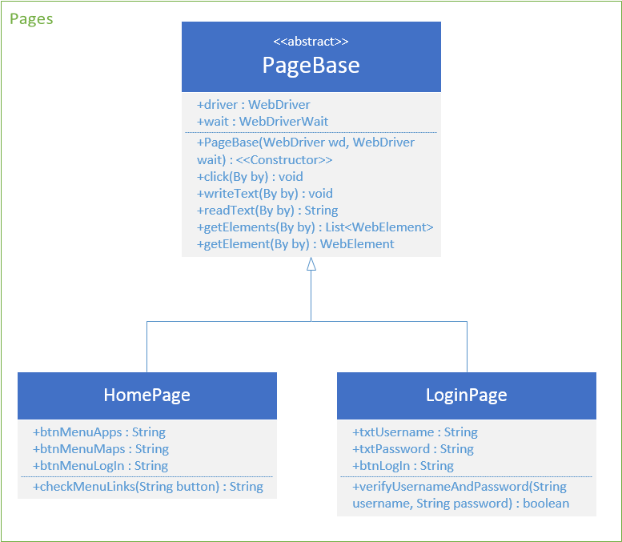

### Tests Paketi:

Test paketi içerisinde sayfalarını ve metotlarını oluşturmuş olduğumuz
sınıflarımızı JUnit kütüphanesi ve “Annotations” yardımı ile sınıfımızı
oluşturuyoruz ve bu sınıfları daha sonra Run As -\> JUnit şeklinde çalıştırıp
test çıktılarımızı alıyor olacağız.

TestBase sınıfı bir önceki örnek olan Kolay Bir Başlangıç’ta Main sınıfı
içerisinde ayaklandırdığımız Setup() ve Stop() metotlarının yeniden
kullanılabilir hale getirilmiş versiyonu denebilir.

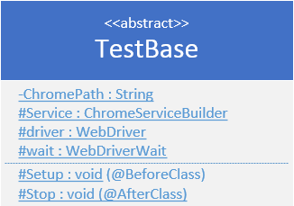
```Java
TestBase.java
--------------
package basics; 
import java.io.File; 
import org.junit.AfterClass; 
import org.junit.BeforeClass; 
import org.openqa.selenium.WebDriver; 
import org.openqa.selenium.chrome.ChromeDriverService; 
import org.openqa.selenium.remote.DesiredCapabilities; 
import org.openqa.selenium.remote.RemoteWebDriver; 
import org.openqa.selenium.support.ui.WebDriverWait; 
public abstract class TestBase { 
    // İndirdiğimiz Chrome_driver.exe’nizin dizini 
    protected static String ChromePath = "C:\\\\Users\\\\User\\\\Downloads\\\\WebDrivers\\\\Chrome\\\\chromedriver_win32\\\\chromedriver.exe"; 
    
    // Chrome Sürücülerinize ulaşmanızı sağlayan servis 
    protected static ChromeDriverService service; 
    
    // Asıl sürücümüz ve Selenium bize sağladığı en büyük nimet olan 
    // bulunduğumuz internet sayfasındaki elemanara(elementlere) 
    // ulaştığımız ve taracıyı kontrol ettiğimiz arkadaş 
    protected static WebDriver driver; 
    
    // Sizin için sürücünüzü bekletecek özellik(opsiyonel) 
    protected static WebDriverWait wait;
    
    // Main fonksiyonumuz 
    public void TestBase(){ 

    } 

    @BeforeClass public static void Setup(){ 
        // Chrome_driver.exe dizininden servisi oluştur ve başlat 
        service = new ChromeDriverService.Builder().usingDriverExecutable(new File(ChromePath)).usingAnyFreePort().build(); 
        try{ 
            service.start(); 
        }catch (Exception e) {
            e.printStackTrace(); 
            } 
        System.setProperty("webdriver.chrome.driver", ChromePath); 
        
        // Driver nesnesini service bilgilerini kullanarak oluştur 
        driver = new RemoteWebDriver(service.getUrl(),DesiredCapabilities.chrome()); 
        
        // Bütün sayfaları açarken 15ms bekle 
        wait = new WebDriverWait(driver,15); 
        
        // Penceri Büyüt 
        driver.manage().window().maximize(); 
    } 
    
    @AfterClass public static void Stop(){ 
        service.stop(); 
        driver.quit(); 
    } 
}
```

HomeTest sınıfımızı hazırlarken **\@Test** annotation’ı ile test metotlarımızı
oluşturuyoruz bu metotlar void olmak zorundadır.

```Java
HomeTest.java
--------------
package tests;
import static org.junit.Assert.*; 
import org.junit.Test; 
import pages.HomePage;
public class HomeTest extends TestBase{
    @Test public void valid_checkMenuLinks() throws InterruptedException{ 
        HomePage home = new HomePage(driver,wait); 
        assertEquals(home.checkMenuLinks(home.btnMenuApps),"https://www.google.com/"); 
        assertEquals(home.checkMenuLinks(home.btnMenuLogIn),"https://accounts.google.com/signin/v2/identifier?hl=en\&passive=true&continue=https%3A%2F%2Fwww.google.com%2F&flowName=GlifWebSignIn&flowEntry=ServiceLogin"); 
        assertEquals(home.checkMenuLinks(home.btnMenuMaps),"https://www.google.fr/maps?hl=en\&tab=wl"); 
    } 
    
    @Test public void invalid_checkMenuLinks() throws InterruptedException { 
        HomePage home = new HomePage(driver,wait); 
        assertNotEquals(home.checkMenuLinks(home.btnMenuApps),"https://www.google.com/123"); 
        assertNotEquals(home.checkMenuLinks(home.btnMenuLogIn),"testedLink.com"); 
        assertNotEquals(home.checkMenuLinks(home.btnMenuMaps),"test"); 
    } 
}
```

LoginTest sınıfınıda aşağıdaki gibi doldururduğumuz takdirde testimizi
başlatabiliriz.
```Java
LoginTest.java
------------------
package tests;
import static org.junit.Assert.*;
import org.junit.Test; 
import org.openqa.selenium.By; 
import pages.HomePage; 
import pages.LoginPage; 
public class LoginTest extends TestBase { 
    @Test public void valid_UsernameAndPassword() throws InterruptedException { 
        HomePage home = new HomePage(driver,wait); 
        LoginPage login = new LoginPage(driver,wait); 
        home.click(By.id(home.btnMenuLogIn)); 
        assertEquals(login.verifyUsernameAndPassword("thejengo0o\@gmail.com", "successPasword"),true); 
    } 

    @Test public void invalid_UsernameAndPassword() throws InterruptedException { 
        HomePage home = new HomePage(driver,wait); 
        LoginPage login = new LoginPage(driver,wait); 
        home.click(By.id(home.btnMenuLogIn)); 
        assertEquals(login.verifyUsernameAndPassword("thejengo0o\@gmail.com", "failPassword"),false); 
    } 
    
    @Test public void empty_UsernameAndPassword() throws InterruptedException { 
        HomePage home = new HomePage(driver,wait); 
        LoginPage login = new LoginPage(driver,wait); 
        home.click(By.id(home.btnMenuLogIn)); 
        assertEquals(login.verifyUsernameAndPassword("", ""),false); 
    } 
}
```
Test paketi için Oluşması beklenen sınıf diyagramı :

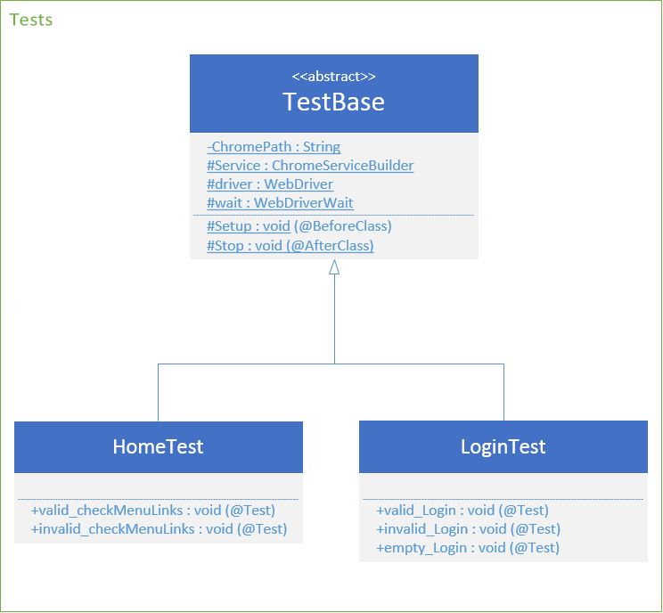

Tüm diyagram ise aşağıdaki gibi olur:

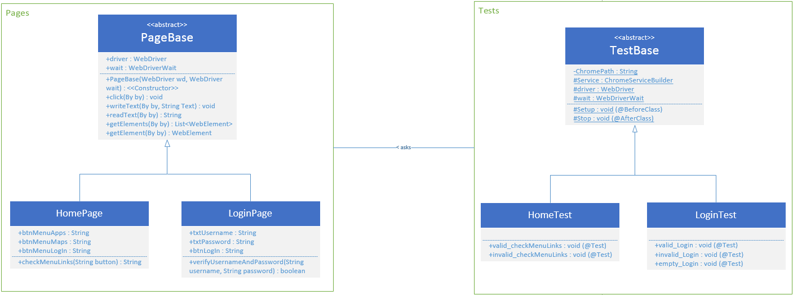

Test Sonuçları
--------------

Yazdığımız onda koddan ve sayfalar üzerinde "name,id,className" vs. aradıktan
sonra sıra projemizin üzerine sağ tık yapıp Run As -\> JUnit Test diyerek
testlerimizi başlatabiliriz.

Korkmayın yine otomatik olarak Chrome açılacak ve sizin yerinize bir sürü test
yapacak. Hepsi bittiği zaman Eclipse üzerinde JUnit penceresinde aşağıdaki gibi
bir ekran size bekliyor olacaktır.

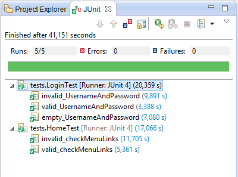

Geçmiş olsun testlerimizi başarıyla tamamlamış bulunuyoruz hepsi inanın bu kadar
kolay ve güzel.

**Test Sonuçlarının Başarısız olması,**


Test sonuçlarının başarısız olması durumunda yukarıdaki görüntüde değişiklik olarak başarısız olan test üzerinde “Error” ibaresi bulunuyor olacaktır ve JUnit sekmesi altında yer alan “Failure Trace” üzerinden başarısız olan veya hata meydana gelen testlerinizin “Root cause”larına ulaşabiliyor olacaksınız.

**Karşılaşılan genel hatalara naçizane öneriler ve ipuçları**

1. En sık karşılaşılan hata durumu WebElement’lerinin sayfa içinde bulunamaması ya da erişiliememesi. Bunun sebebi genellikle “xpath, cssSelector” gibi By sınıfı üzerinden gönderilen ifadelerin tarayıcıdan tarayıcıya ya da yeni elementler eklenmesi durumlarında değişmeleri. Sürekli güncelleme ve bakım gerektirecektir. Bu seçiciler yerine “name, id, cssClassName” gibi daha sabit ve oturaklı seçicileri kullanmanızı tavsiye ederim.
2. assertEquals() metodunu kullanırken elinizden geldiğince primitive(ilkel) tipler ile kullanmaya çalışın. Sizin açınızdan da sizden sonra kodu okuyacak olanlar açısından da kodu takip etmesi kolaylaşır.
3. assertEquals() içine gönderdiğiniz parametreleri doğru hesaplayın.
4. UnReachableRemoteException adında bir hata var bu hata genellikle test simülasyonu çalışırken simülasyon ortamını/tarayıcısını kapattığınız da veya test sonucunda service ve driver nesnelerinin doğru şekilde sonlandırılmadığı zamanlarda çıkar. Benim çok canımı sıkan bir hataydı.
5. Alert gibi Select gibi farklı çıktılara erişirken sistem çok hızlı çalıştığı için sistemi Thread.sleep(300–500) gibi komutlarla yavaşlatıp alertleri ve selectleri doğru bir şekilde yakalamak.
6. GET / POST gibi HTTP istekleri yaparken yine yukarıdaki gibi Thread.sleep(2000) gibi değerler kullanıp sistem cevap verdikten sonra simülasyonu devam ettirmek. Yoksa 1. maddedeki hatalarla karşılaşmamanız işten bile değil.
7. Fail olan testlerinizin neden fail olduğunu güzelce incelemek Failure Trace’i iyi okumak yetersiz bulunursa “Errors, Problems, Console” sekmelerinden hataları takip etmek gerekirse bol bol googlelamak.
8. POM’u iyi anlamak ve uygulamak.
9. Kütüphaneleri doğru tanımladığımızdan ve Build Path’e eklediğimizden emin olmak.
10. Sakin, sabırlı ve yapıcı olmak :) (Faydası büyük)

TestNG 
-------

Testlerinizi daha kusursuz ve düzenli geliştirmek isterseniz kullanabileceğiniz
yardımcı kütüphanedir. Testlerinizi önceliklendirebilir, geliştirebilir ve daha
düzgün çıktılar ile hata raporlarını gözleyebilirsiniz. Şu an için yukarıdakiler
yeterli olacaktır. Merak edenler için <https://testng.org/doc/index.html>
adresinden daha detaylı bilgilere ulaşabilirler.

Özet
----

Uzun lafın kısası olarak yukarıdakilerin hepsini özetlemeye çalışırsak,

1. Kurulum ilgili dosyaların indirilmesi kurulması

2. Java projesinin oluşturulması ve indirilen dosyaların enjektesi

3. İsterseniz direkt bir main dosyası içinde küçük deneyler için

4. İsterseniz büyük ve detaylı siteleriniz içim POM ile nesneye yönelik ve esnek bir yapı ile testlerinizi kontrol etmek

5. Testi çalıştırma hataları ve takip etme

6. İpuçları ve Püf noktalarına dikkat etme

7. Daha fazla ve detaylı testler için TestNG

Özeti de yaptığımıza göre yazının sonuna gelmiş bulunduk, biraz uzunda olsa
umarım hepiniz sıkılmadan eminim okudunuz, buralara kadar direkt gelmediğinizi
tahmin ederekten iyi günler dilerim.

Medium da görüntülemek için: <a href="https://medium.com/@thejengo/15-dakikada-selenium-i%CC%87le-testlenin-1efff75b1650">15 Dakika Da Selenium İle Testlenin</a>

**T E S T L E N D İ N İ Z !**