JIRA Nedir?
----------

Tanıtım
-------

JIRA Atlassian Inc. tarafından geliştirilen Proje ve Süreç Yönetim aracıdır. Bu
araç şirketler tarafından hem iş akış süreçlerini takip etmek hemde müşterilerin
veya kullanıcıların isteklerine, sorun ve hatalara çevik(agile) metodolojiler
ile yanıt vermek amacıyla kullanılır. JIRA’nın sahip olduğu yoğunlukta olan
kullanıcıları kurumsal düzeydeki destek, planlama, raporlama ve daha fazlasına
ihtiyaç duyan çevik(agile) takımlardır.

Amaçları
--------

JIRA’nın en temel amaçları:

-   Sorun ve Hata Kayıtları,

-   Sorun ve Hata Takibi,

-   Gelişmiş Proje Yönetimi,

-   Derinlemesine Çevik(Agile) Raporlama,

-   Çevik(Agile) Yol Haritası Çıkarma,

-   Koşu(Sprint) Planlaması.


Artıları/Eksileri
-----------------

| Artıları                                                                                     | Eksileri                          |
|----------------------------------------------------------------------------------------------|-----------------------------------|
| -   \+3000’den fazla uygulamaya entegre edilebilir.(Freshdesk, GitHub, GitLab, Zendesk, vb.) | Yeni başlayanlar için çok karışık |
| -   \+1000’den fazla eklenti.                                                                |                                   |
| -   Özelleştirilebilir İş Akışları                                                           |                                   |
| -   Gelişmiş takım iç görüleri                                                               |                                   |
| -   Raporlama Araçları                                                                       |                                   |
| -   Rakiplerine göre çok daha pahalı                                                         |                                   |

Rakipleri
---------

JIRA şu an piyasada rakipsiz gibi gözükse de maddi olarak küçük ve orta ölçekli
çoğu şirket için JIRA çok büyük maliyetlere sahip olabilmektedir. Bu nedenle
JIRA’ya hem özellik özellik olarak yakın veya üstün ya da maddi olarak daha
uygun olan rakipler piyasada günden güne çoğalmaktadır. Bunların başında Trello
ve Intelij Idea’nın yeni duyurduğu YouTrack uygulamaları gelmektedir.

JIRA Türleri Nelerdir?
======================

*JIRA Software Cloud* size hem kendi bulut(cloud) sunucuları üzerinde ya da
sizin seçmiş olduğunuz bir bulut üzerinde işlemleri gerçekleştirebilme olanağı
sağladığı gibi aynı zamanda *JIRA Software Server* ile size kendi sunucularınız
üzerinde çalıştırabileceğiniz bir versiyonuda sunar. Eğer çok daha fazla
özelleştirme ve detaylı işlemler yapmak istiyorsanız genellikle tercih edilen
versiyonu *JIRA Software Server*’dır.

JIRA Software Server Nasıl İndirilir ve Kurulur?
================================================

<https://www.atlassian.com/software/jira/download> adresinden indirmek/kurmak
istediğiniz sürümü(version) ve sunucunuza(kendi bilgisayarınız da olabilir)
uygun olan özellikleri seçerek indirme işlemini başlatalım. Bu yazıda 30 günlük
deneme versiyonu üzerinden anlatılacağı için tam sürüm performansında ya da
özelliklerinin hepsinin aktif olmaması muhtemeldir. Bu yazı içerisinde indirilen
JIRA Software sürümü(version) 7.12.3’tür.

![(./media/1ce44281a49d25ea857bf38946002dbf.png)

JIRA Software Server-Side kurarken gerekli olan gereksinimler:

-   Java Runtime Environment ( genelde JIRA kurucu dosyası kendisi kurar ve
    ayarlamaları yapar)
-   500MB – 1GB arası Java Heap hafızası değerlendirme aşamasında yeterlidir.
-   Değerlendirme aşamasında JIRA H2 Veritabanı kullanır. Kurulum ile birlikte
    gelir.
-   Güvenlik konusunda ise Symantec dışında bütün güvenlik uygulamalarına
    açıktır. Symantec programın çalışması esnasında performans düşüklüğüne yol
    açmaktadır.

JIRA Software gereksinimleri hakkında daha detaylı bilgiler için:
-   <https://confluence.atlassian.com/adminjiraserver/jira-applications-installation-requirements-938846826.html>
Kurulum hakkında detaylı bilgiler için:
-   <https://confluence.atlassian.com/adminjiraserver/installing-jira-applications-on-windows-938846835.html#InstallingJiraapplicationsonWindows-3.Choosesetupmethod>

Kurulum aşamaları:

1.  İndirmiş olduğumuz çalıştırılabilir dosyayı yönetici olarak çalıştırın.


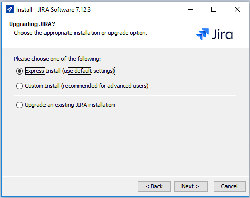

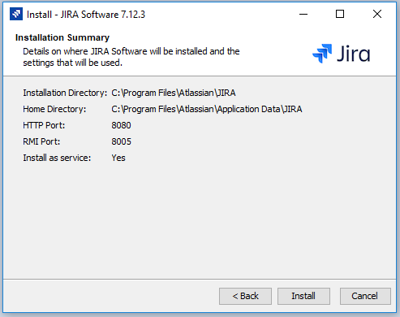

Express Install(Hızlı Yükleme) seçeneğini seçmeniz taktirde yukarıdaki gibi
direkt bir şekilde yükleme aşamasına geçebilirsiniz.

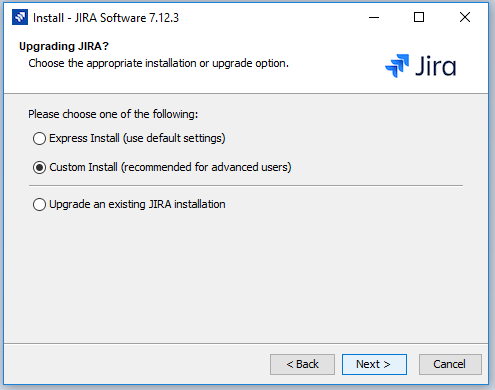

Custom Install(Özel Kurulum) seçeneğinin seçilmesi durumunda aşağıdaki işlemler
gerçekşecektir.

1.  Aşamaları takip edin ve aşağıdaki seçenekleri dikkatlice seçin:

    1.  **Destination directory:** JIRA’nın yükleneceği yer.

        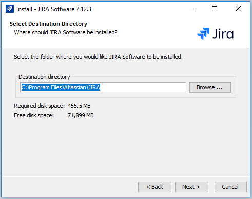

        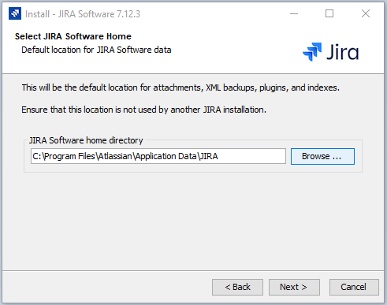

    2.  **Home directory:** Jiraya ait logların, arama indekslerinin ve
        dosyalarının tutulacağı yer.

        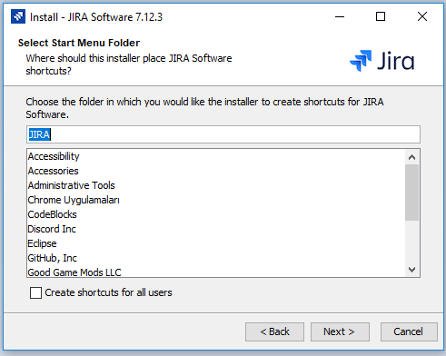

    3.  **Select Start Menu Folder:** Sunucu/Bilgisayarınız üzerinde kurulu olan
        uygulamardan hangisi için Jira’nın kısa yol oluşturmasını isterseniz
        onları seçiniz diyor JIRA olarak kalması önerilir.

        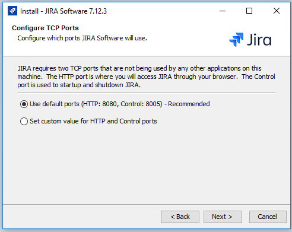

    4.  **TCP ports:** Jira’nın çalıştırılacağı HTTP bağlantı ve kontrol
        portları. Aynı port üzerinde başka uygulamalar çalıştırmıyorsanız
        Genel(Default) ayarları kullanmanız önerilir.

        Ben normal ayarları kullanacağım için Port seçimi konusunda değişiklik
        yapmadım sizler ihtiyaçlarınıza göre *Set custom value for HTTP and
        Control ports* seçeneği ile Jira portlarını yeniden
        yapılandırabilirsiniz.

        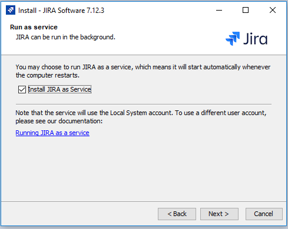

    5.  **Install as service:** Bu opsiyon sadece Yönetici olarak
        çalıştırırsanız gözükecektir.

        

Özet ekranında yapmış olduğunuz seçimlerin özeti gözüküyor olacaktır. Bu
bilgileri teyit ettiğiniz taktirde Install diyip yükleme işlemini
başlatabilirsiniz.

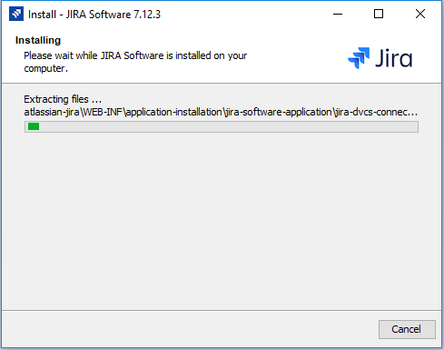

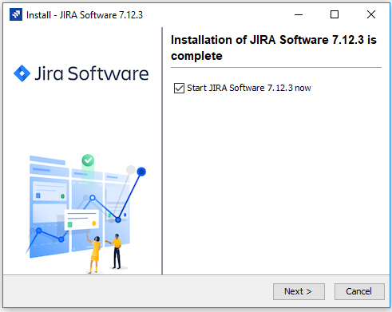

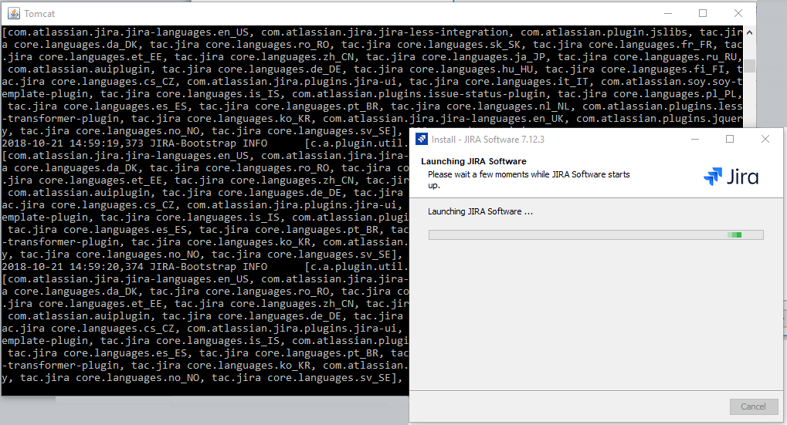

Bu ekranlar sizi korkutmasın gereksinimlerde belirttiğimiz kurulum için gerekli
olanların hazırlanması işlemleri gerçekleştirilmektedir.

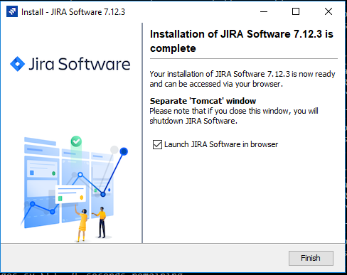

JIRA yükleme tamamlandıktan sonra tarayıcınızda başlatılacaktır.

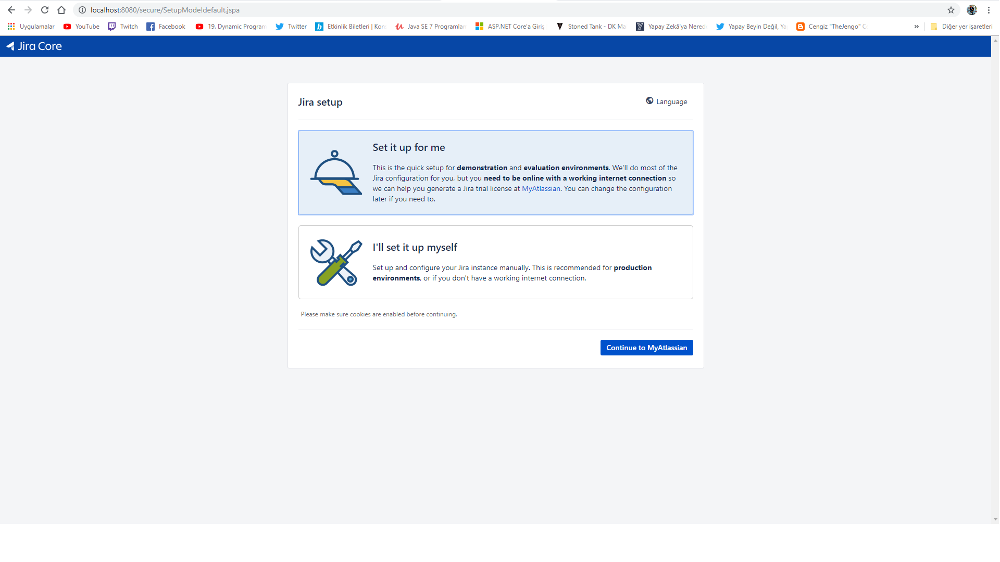

İlk açıldığında yukarıdaki ekranı görüyor olacaksınız. Jira için temel
ayarlarınızı yapılandırmanızı istiyor sizden, isterseniz Setup it up for me (
Benim için yap) seçeneği ile otomatik yapılandırma yaparak hızlıca kullanmaya
başlayabilirsiniz ya da I’ll set it up myself( Ben yapılandırırım) diyerek
detaylıca özelleştirip düzenleme yaparak başlatabilirsiniz. Bu yazıda
deneme(trial) sürüm üzerinde işlem yaptığımız için ilk seçeneği seçeceğim ve sağ
alttaki mavi buton ile bir MyAtlassian ayarlaması yapacağım.

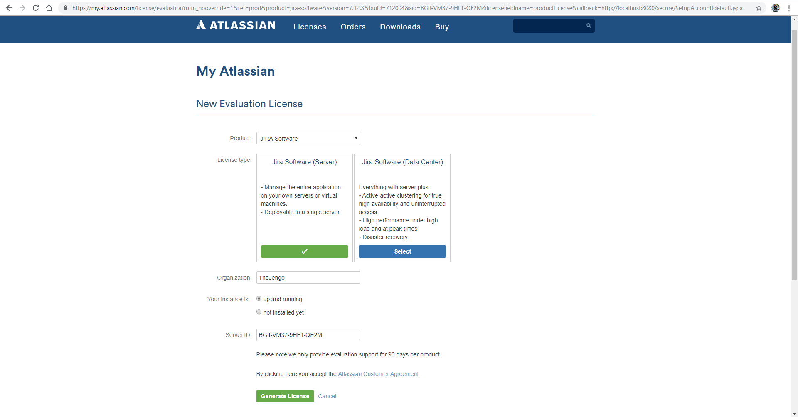

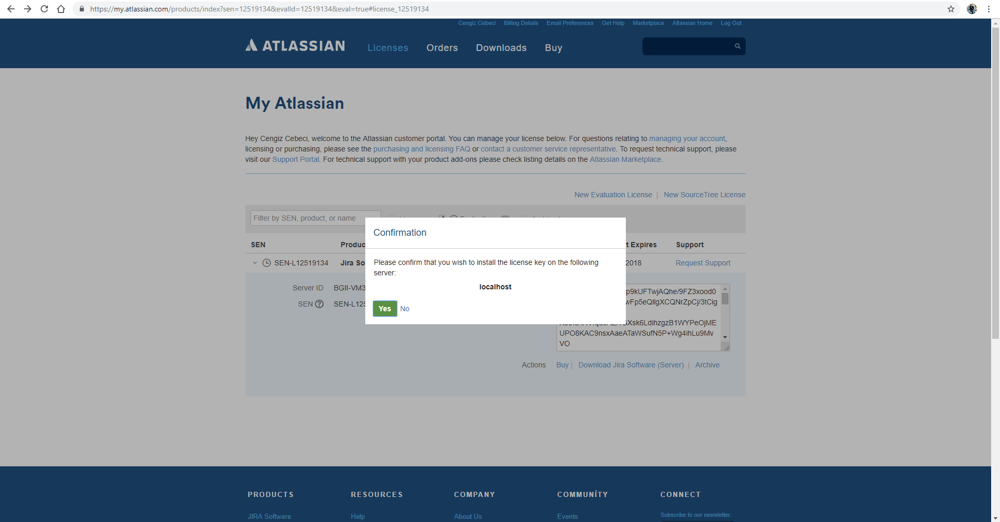

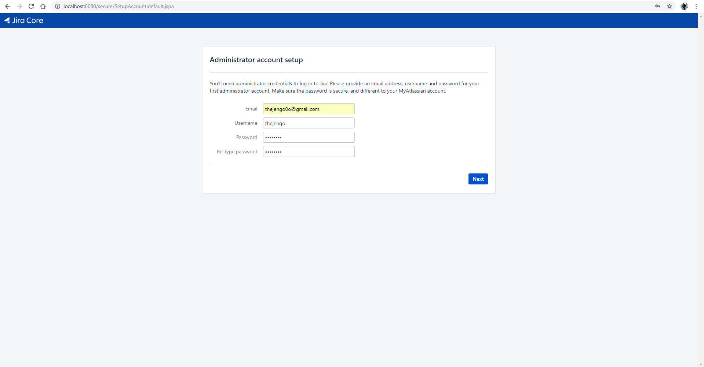


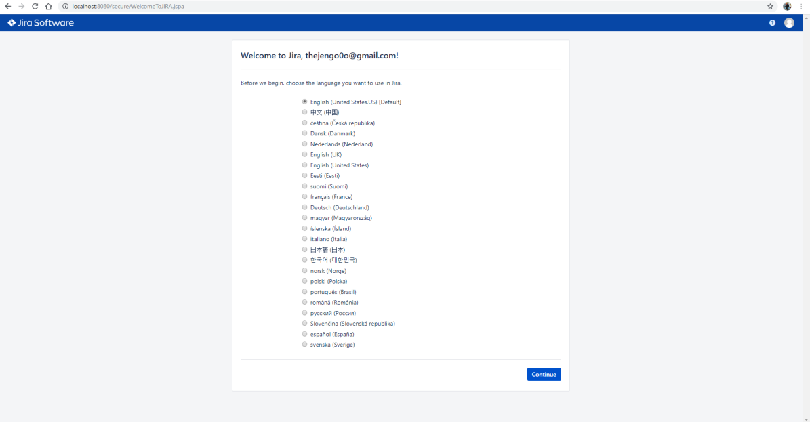

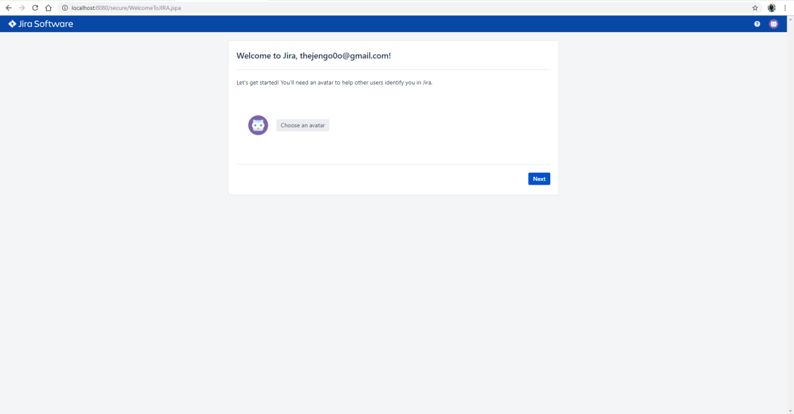

Yukarıdaki adımları hızlıca tamamladıktan sonra artık başlayabilir gibi
duruyoruz.

JIRA Nasıl Kullanılır?
----------------------

Proje Oluşturma
---------------

Jira kurulumumuzu tamamladıktan sonra nihayetinde Welcome! Ekranına ulaşıyoruz
ve ilk projemizi oluşturup özellikleri inceleyelim.

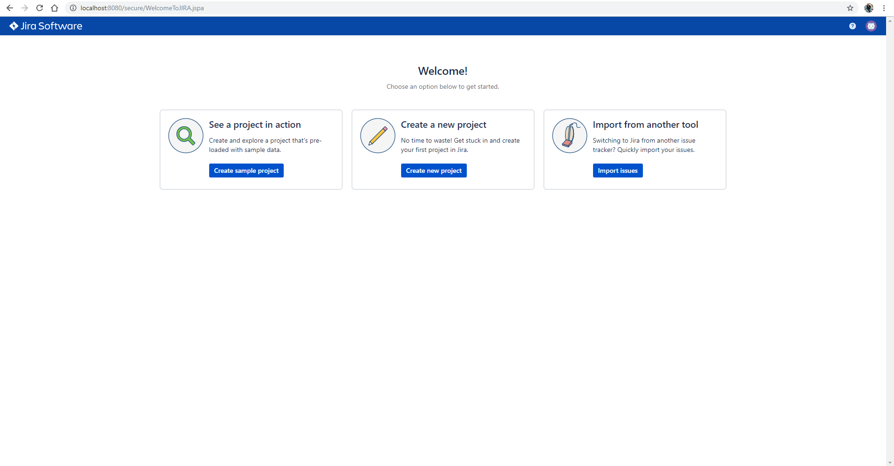

-   **See a project in action:** örnek verilerle oluşturulmuş bir projeyi
    inceleyin.
-   **Create a new project:** sıfırdan bir proje oluşturmak ve yönetmek için.
-   **Import from another tool:** daha önce kullandığınız sorun takip
    araçlarından aktarılmış verileri içeri aktar ve kullan.

*Create a new project* seçeneğini seçip gelen model üzerinden *Kanban software
development* seçeneğini seçip ilk projemizi oluşturabiliriz. Temel açıklamaları
yaptıktan sonra sizden projeniz için bir isim ve anahtar oluşturmanızı
isteyecektir.

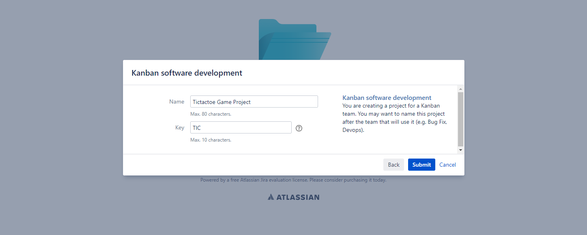

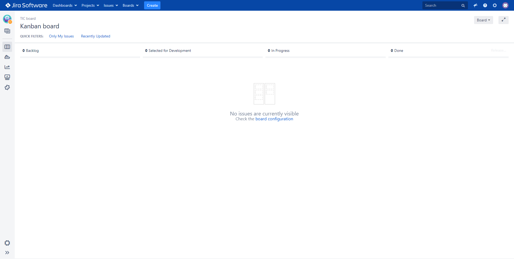

Ve karşınıza projenize ait proje detay sayfası gelecektir. Bu sayfa üzerinden
User Story’lerinizi yönetebilir, Kanban tablonuzu güncelleyebilir, görevler
atayabilir ve daha fazlasını kolayca gerçekleştirebiliyor olacaksınız.

Peki bu tabloyu nasıl doldurabiliriz sorusunu ise üst menü üzerinde bulunan
“Create” butonu ile gerçekleştiriyor olacağız.

Bir istek oluşturmak (Creating a Issue/Bug/Story/Task/Epic)
-----------------------------------------------------------


Bu düğmeye bastığınızda karşınıza aşağıdaki gibi bir ekran gelecektir.

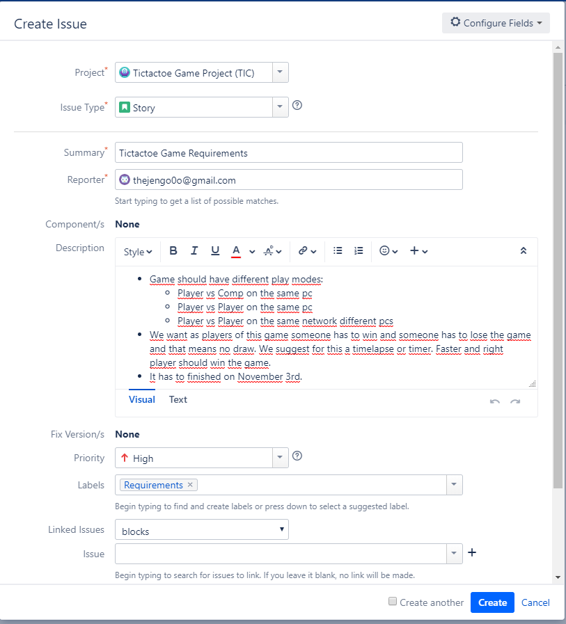

Gelen ekran üzerinden alanları isterlerine göre doldurduğunuz taktirde Create
düğmesi ile devam edebiliriz. Devam etmeden önce ekran üzerindeki önemli birkaç
yeri açıklamak daha doğru bir kullanım için yeterli olacaktır. *Configure
Fields* diyerek bu from ekranını geliştirebilirsiniz.

### Issue Type(Sorun Tipi)

Sorun tipi olarak kabaca çevirilebilir peki nedir?

- **Epic**  | Jira tarafından otomatik oluşturulur ve silinmesi tavsiye edilmez. Issue Type olarak büyük ve önemli User Story’ler için kullanılır. 
- **Story** | Jira tarafından otomatik oluşturulur ve silinmesi tavsiye edilmez. User storyler için kullanılır.
- **Task**  | Yapılması gereken bir görev için oluşturulur.
- **Bug**   | Ürünün işlevlerini bozan veya engelleyen bir problem için kullanılır.


Yukarıdaki 4 tipe ait bilgilere göre Sorun tipi oluşturmak projenin
organizasyonunu kolaylaştıracağı gibi yukarıdaki tipler size yetersiz geliyor
ise kendi istekleriniz doğrultusunda farklı tiplerde ekleyebilirsiniz.

### Priority(Önem/Öncelik)

Bildirmekte olduğunuz kayıt(issue) hakkındaki önem derecesi geliştirici ekip
tarafından önceliğe alınmasına dair geliştiricilere ve ekiptekilere bilgi verir.
Nedir bu öncelikler derseniz aşağıdaki tablo üzerinde inceleyebiliriz.

- **Highest** | Bu sorun işleyişi durduracaktır.
- **High**   | İşleyişi durdurabilecek ciddi bir sorun.
- **Medium**  | İşleyişi etkileme potansiyeli bulunan bir sorun. 
- **Low**     | Kolayca atlatılabilinen küçük çaplı bir sorun.
- **Lowest**  | Küçük ya da hiç etkisi olmayan önemsiz sorun.

### Assignee(Görevli)

Açılan Issue eğer bir yönetici tarafından yönetiliyor ise bu Issue direkt olarak
geliştiricilere atanabilir veya kişi görevi kendisine atayabilir.

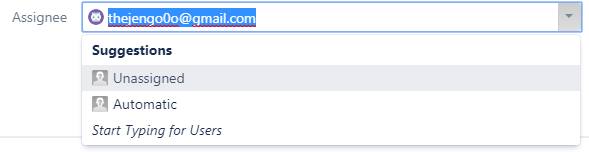

Oluşturma adımlarını tamamladığınız ve “*Create*” düğmesi ile devam ettiğinizde
aşağıdaki gibi Kanban tablonuza bir backlog olarak yeni gelen istek düşecektir.

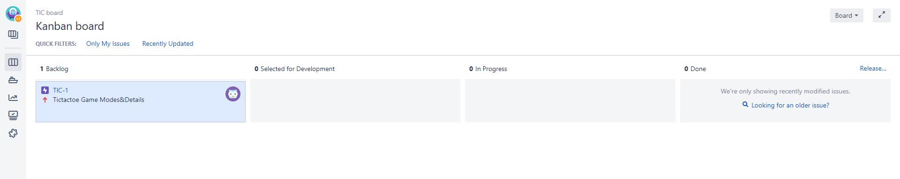

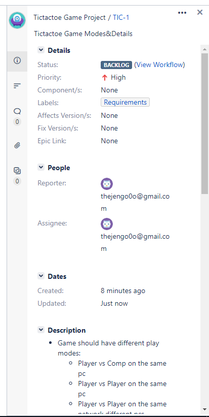

Üzerine tıkladığınızda ise sağda açılan pencere şu şekilde olacaktır ve bu
pencere içerisinde detay bilgiler yer almaktadır. Bu bilgileri yine aynı panel
üzerinden düzenleyebilirsiniz.

Bu noktadan sonra backloglarınızı sürükleyerek tablo üzerinde istediğiniz
konumlara atayabilirsiniz.


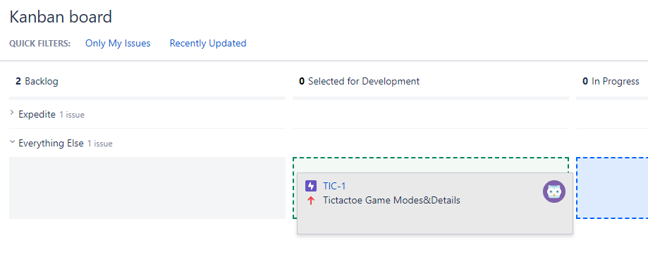

Tablo Yönetimi ve Kullanımı
---------------------------

Jira da bir tablo üzerinde kolayca işlerinizi veya yeni eklenen
istekleri/sorunları bulmak, yönetmek istiyorsanız tablonun hemen üstünde yer
alan “*Quick Filters*” özelliği ile isterseniz “*Sadece Kendinize Ait Olayları*”
ya da “*Yeni Güncellenenleri*” bir tıklama ile görebilirsiniz.

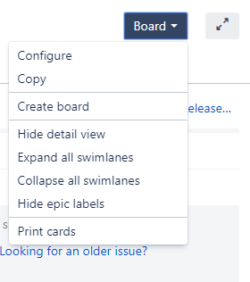


Tabloyu yönetmek ve yapılandırmak için tablonun içerisinde sağ üst kısımda
bulunan düğmeden yapabilirsiniz.

-   **Configure:** Yapılandırma sayfasına yönlendirir bu sayfadan tablonuzun tüm
    ayarlarını yapılandırabilirsiniz.
-   **Copy:** Tablonuzu kopyalar ve yeni bir tabloda açar.
-   **Create Board:** Projenize yeni bir tablo eklemenizi sağlar bu tablo bir
    Scrum Tablosu ve ya Kanban Tablo olabilir.(Not: açtığınız tablo projeniz
    içerisindeki backlogları kullanmaktadır. Bir backlogu X tablosunda
    güncelleyip silerseniz Y tablosunda da aynı işlemler yapılır.)
-   **Show/Hide detail view:** Backlog detaylarını göster/gizle.
-   **Expand all swimlanes:** Bütün alanları genişlet.
-   **Collapse all swimlanes:** Bütün alanları daralt.
-   **Hide epic labels:** Epic etiketine sahip Issue’ların etiketlerini gizler.
-   **Print Cards:** Kartları yazdırma aracına yönlendirir ve buradan seçtiğiniz
    kartı yazıcıdan çıkartacak şekilde düzenler.

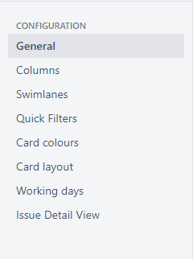

*Configuration* seçeneği seçildiği taktirde açılan sayfada solda bulunan menü
üzerinden tablolarınızı yapılandırabilirsiniz.

-   **General:** Genel sekmesi altında temel ayarlar bulunur.
-   **Columns:** Tablonuzda bulunan “**Backlog**, **Selected For Development**, **In**
    **Progress**, **Done**” gibi alanların bulunduğu ve bu alanların hangi durumlarda
    nasıl işlevler göstereceklerinin belirlendiği, eklenip, çıkarılabildiği ve
    düzenlenebildiği bölümdür.
-   **Swimlanes:** Yapılacak olan backloglara ait gruplandırma ayarlarını içerir.
-   **Quick Filters:** Tablo üzerinde Issue’lara erişmek için özel olarak
    ayarlayabileceğiniz filtereleme bölümüdür.
-   **Card colours:** Issue kartlarının renklerinin hangi koşula göre olacağını
    düzenleyebileceğiniz yerdir.
-   **Card Layout:** Issue kartlarının şablonlarını düzenleyeceğiniz yerdir.
-   **Working days:** Ekibinize dair çalışma günlerinizi ve bu günlerin detayları
    vardır.(Burndown chart gibi raporlama araçlarının takım iç görülerinizi
    doğru bir şekilde raporlaması için önemlidir.)
-   **Issue Detail View:** Tablo üzerinde detayını görmek için seçtiğiniz
    backlog’a ait detayları yapılandırabileceğiniz yerdir.

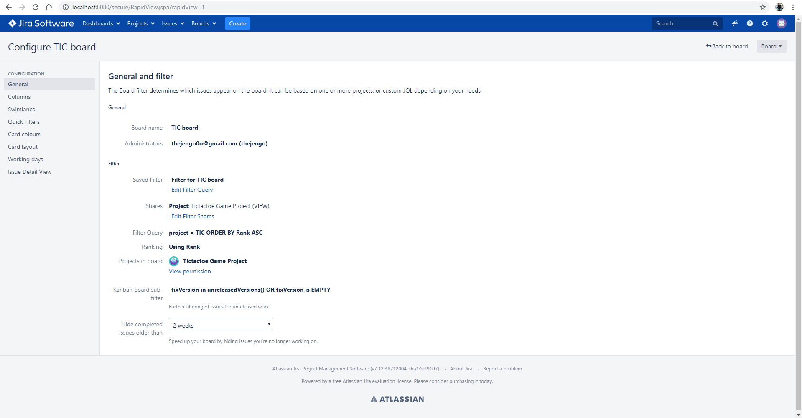

### Tablo Özelleştirme

Tablo Yönetimi ve Yapılandırma kısmı içerisindeki “**Columns**” menu elemanı
altında bulunan bölümden “**Add Column**” düğmesine tıklayıp uygun parametreleri
girip “**Add**” deyip oluşturabilirsiniz.

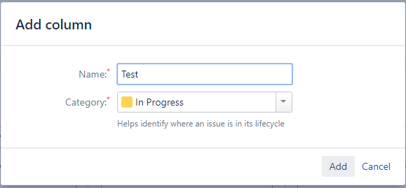

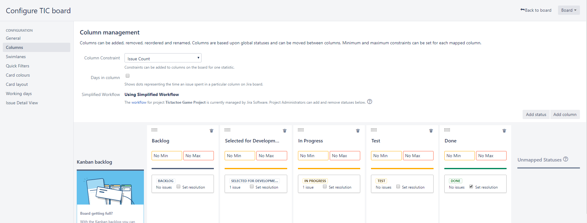

Proje Yönetimi ve Yapılandırmaları
----------------------------------

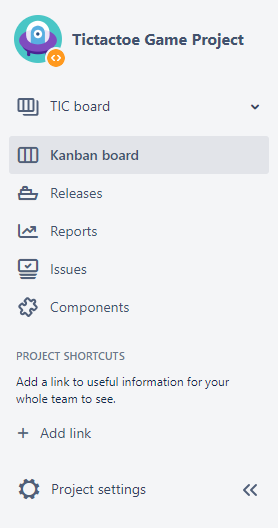

Projenizi hızlı bir şekilde yönetmek ve kullanmak için proje detay sayfanız
içerisinde solda yapışık bulunan hızlı erişim çubuğundaki:

-   **Board:** projenize ait görüntülemek istediğiniz tabloyu seçmek için
    kullanılır.
-   **Kanban Board:** Seçili tabloyu görüntüler.
-   **Releases:** Sürüm yayınlama ve yönetim ekranını görüntüler.
-   **Reports:** Projeye dair hızlı ve hazır şablonlarla veya özel biçimlerde
    raporlar oluşturabileceğiniz ekrandır.
-   **Issues:** Sorunları/Istekleri daha detaylı görüp inceleyebileceğiniz yerdir.
-   **Components:** Projenize ait alt dallanmalar, bileşenler veya projeleri
    yönetebileceğiniz ekrandır. Bu ekran üzerinden atamalar yaparak projenizi
    zenginleştirmenin yanı sıra daha küçük parçalar halinde yönetmenize imkan
    sağlar.
-   **Project Shortcuts:** Projenize ait olan önemli linkleri diğer kullanıcılarla
    paylaşabileceğiniz hızlı erişim alanıdır.
-   **Project Settings:** Projenizi daha kompakt bir şekilde yönetip
    **yapılandırabileceğiniz** ekrandır.

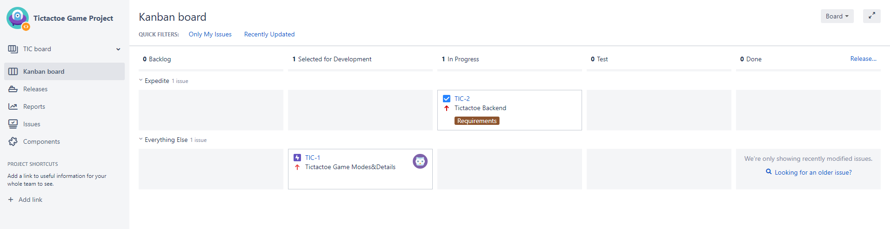

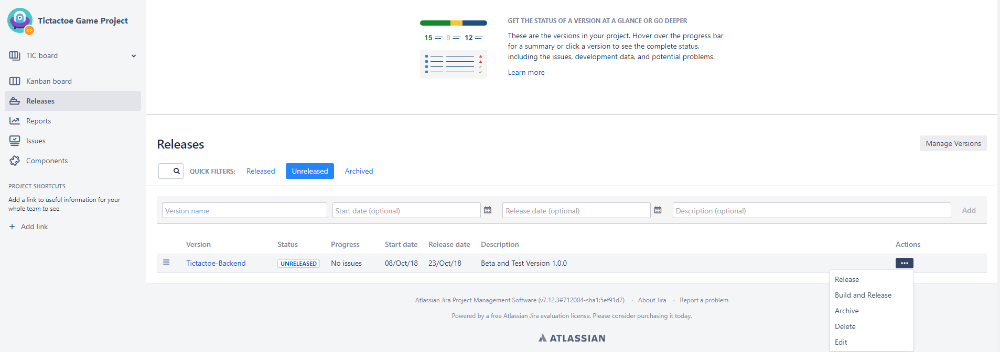

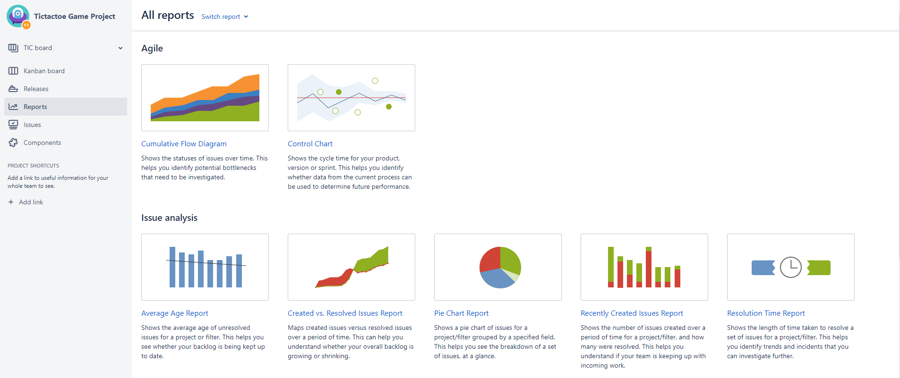

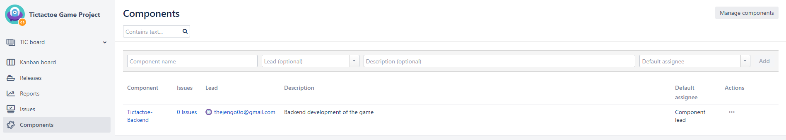

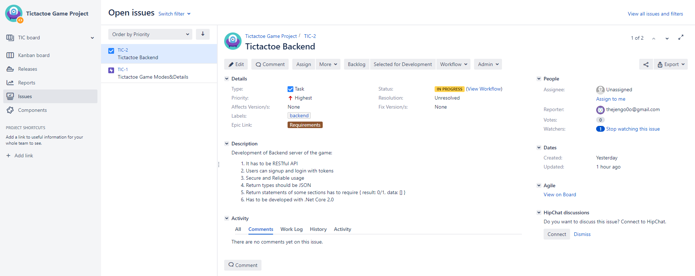

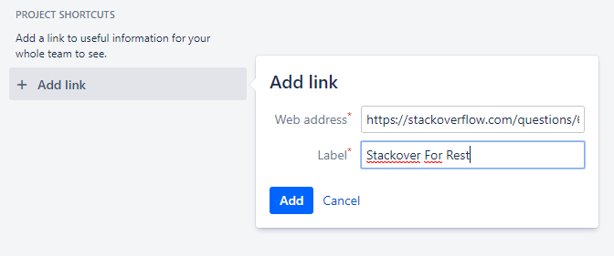

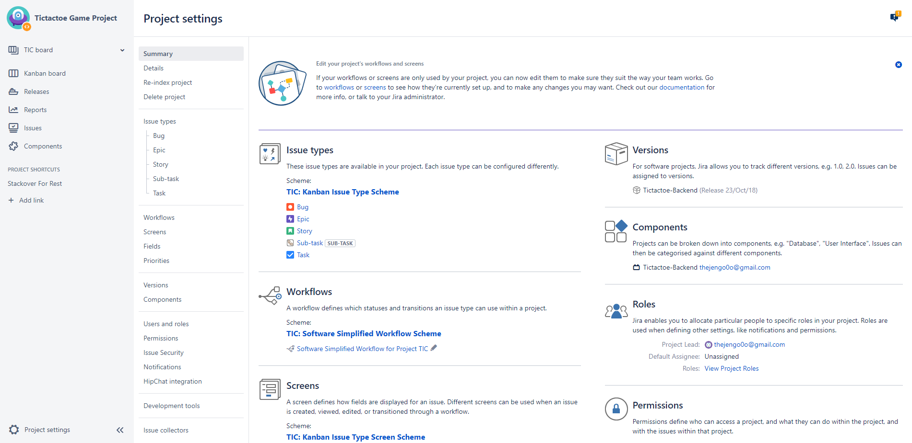

-   **Summary:** Aslında bu kısım, farklı ekranlardan yapılan işlemlerin bir araya
    toplantığı, gerçekten özet niteliğinde bir ekrandır. Zira bu işlemleri Jira
    Administration kısmını kullanarak da gerçekleştirebilirsiniz.
-   **Details:** Bu kısımda projenizin adı, key’i, varsa web adresi(URL), Proje
    tipi, proje kategorisi, avatarı, açıklaması, proje lideri, varsayılan olarak
    işlerin atanacağı kişi bilgisi gibi bilgiler değiştirilebilir.
-   **Re-index:** Proje içerisinde çok fazla Issue olduğunda nadiren projelerin
    içerisinde yer alana arama alanlarının doğru çalışmadığı gözlemlendiği için
    gerekli durumlarda bu sorunların giderilmesi için proje veri tabanını
    yapılandırmak için indekslemelerin düzeltilmesi işleminin
    gerçekleştirilebileceği ekrandır.
-   **Delete Project:** Oluşturduğumuz projeyi silmek için kullanabileceğimiz
    item.
-   Issue Types: Issue’lara ait özelliklerin düzenlenebildiği yerdir.

    -   **Bug:** Bu issue’ya ait workflowun düzenleneceği alanı barındırır.

    -   **Epic:** Bu issue’ya ait workflowun düzenleneceği alanı barındırır.

    -   **Story:** Bu issue’ya ait workflowun düzenleneceği alanı barındırır.

    -   **Sub-Task:** Bu issue’ya ait workflowun düzenleneceği alanı barındırır.

    -   **Task:** Bu issue’ya ait workflowun düzenleneceği alanı barındırır.

-   **Workflows:** Projemiz için bir iş akışı oluşturabilir, mevcut iş akışlarını
    düzenleyebilmemize olanak sağlayan ekrandır.
-   **Screens:** Issue tipine göre ekranlardaki görünür alanlarla ilgili
    düzenlemeleri yapabileceğiniz yerdir.
-   **Fields:** Yeni bir issue oluştururken doldurmamız istenen alanlara yeni bir
    alan eklemek istersek, bunu custom fields tanımlayarak yapabiliyoruz. Burada
    seçili proje için oluşturulacak issue’lardaki alanların güncellenmesi/yeni
    alan eklenmesi/çıkarılması vb. işlemler gerçekleştirilebilir.
-   **Priorities:** Bir issue’nun önemiyle ilgili olarak belirtimde bulunduğunuz
    öncelikleri düzenleyebileceğiniz yerdir.
-   **Versions:** Versiyonların tanımlandığı, açtığımız issue’larda bu
    versiyonların hangisinde geliştirme yapacağımızı ya da etkilenen
    versiyonları seçebiliriz. Aynı zamanda release ya da derleme işlemi gibi
    işlemler de yapabilirsiniz.
-   **Components:** Projede geliştirilecek olan özellikleri daha küçük parçalara
    ayırarak bunların yönetilmesi görevini de başka bir kullanıcıya vermek üzere
    kullanılan bir özellik. Bileşenler eklenip, kaldırılabilir. Kaldırılırken,
    bileşen içerisinde açılmış olan issue’ları başka bir bileşene taşımamızı
    isteyecektir.
-   **Users and Roles:** Projenizde görevli olmak üzere
    kullanıcıları/geliştiricileri rollerine göre ekleyip çıkartabileceğiniz
    alandır.
-   **Permissions:** Projeye dahil olmuş kişilerin rollerinin izinlerini
    düzenleyebileceğiniz yerdir.
-   **Issue Security:** Projeye ait issue seviyesinde bir güvenlik seviyesi
    belirleyerek, hangi kullanıcı grubu tarafından görüntülenebileceğini
    belirlemek için kullanılabilecek seçenektir. Öncelikle Güvenlik şeması,
    sonra güvenlik seviyesi tanımlamak ve kullanıcı ya da grupları eklemek
    gerekir.
-   **Notifications:** Projedeki issue’ların üzerindeki her hangi bir değişiklik
    yapılması halinde kimlere ve hangi mail adresi üzerinden mail
    gönderileceğini değiştirebildiğimiz ekran. Bu ekran sayesinde her olay için,
    hangi kullanıcı gruplarına ya da hangi kullanıcıya mail gönderileceğini
    belirleyebiliriz.
-   **HipChat Integration:** Şirket içi mesajlaşma uygulaması hipchat entegrasyonu
    için kullanılabilecek menü öğesi.
-   **Development tools:** Geliştirme araçlarınızı Jiraya entegre edebileceğiniz
    ekrandır.
-   **Issue Collectors:** Projenizle ilgili kullanıcılardan hızlı geri
    dönüşler(feedback) alabilmeniz için projenizin içerisine
    yerleştirebileceğiniz bir geri bildirim düğmesi oluşturmanıza yarar ve son
    kullanıcıların yaptığı geri bildirimleri direkt olarak Jira projenize
    aktarır.

JIRA Yönetimi ve Kullanımı
--------------------------

Jirada hızlı erişim çubuğu olarak da adlandırabileceğimiz üst menü üzerinde
bulunan bu 6 düğme üzerinden hızlıca doğru alanlara ulaşabilir ve işlerinizi
gerçekleştirebilirsiniz.

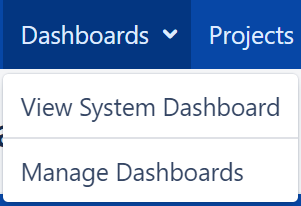


-   **Dashboard:** üzerinden projelere ait güncel verilere, size atanan issue’lara
    hızlıca ulaşabilir daha fazlası için ise Manage Dashboards diyerek daha
    detaylı bir karşılama ekranına sahip olabilirsiniz.


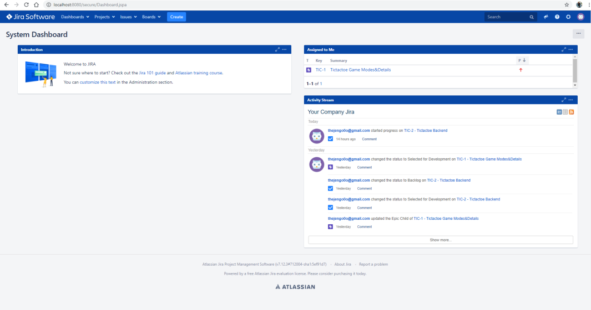

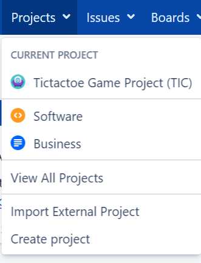

-   ***Projects:** açılır menüsü üzerinden anlık projelerinize, şirketinizin
    bünyesinde bulunan ve oturum açmış herkese açık olan yazılım ve iş
    projelerine ulaşabilir, dışarıdan bir projeyi içeriye aktarabilir ya da yeni
    bir proje oluşturabilirsiniz.

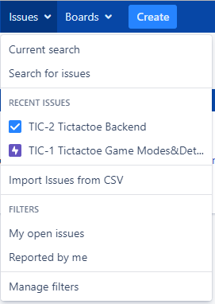

-   **Issues:** Hızlıca issue’lar arasında arama yapabilir, son aramalarınıza
    ulaşabilir, geçmişte görüntülediğiniz son issuelara hızlıca ulaşabilir, bir
    excel dosyasından issueları içeri aktarabilir, açtığınız issue’ları takip
    edebilir, size açılmış issueları görebilir, ve bu filtreleri
    özelleştirebileceğiniz ekranlara ulaşabileceğiniz menü elemanıdır.

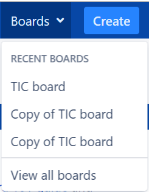

-   **Boards:** Tablolar menü elamanı altında son görüntülemiş olduğunuz tablolar
    vardır. Tüm tabloları görüntüle dediğiniz taktirde daha önce ziyaret
    ettiğiniz/görüntülediğiniz tüm tabloların listesi sizleri karşılayacaktır.


-   **Create:** Projeleriniz için Issue oluşturmanızı sağlayan modeli açar.


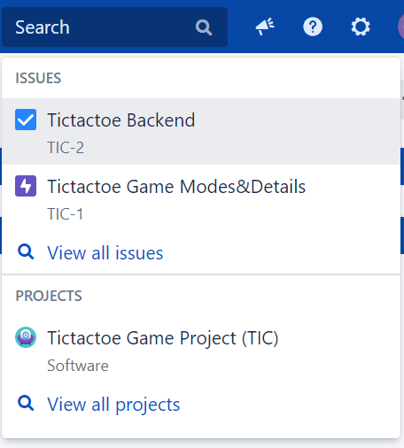

*Search:* Issue’larınızı ya da projelerinizi hızlı bir şekilde arama
yapabileceğiniz yerdir.


*Feedback:* Jira’nın geliştirilmesi için Jira geliştiricilerine notlar
bırakabileceğiniz, geri dönüşte(feedback) bulunabileceğiniz düğmedir.
Tıkladığınız da bir model açılır. Ayrıca bir Issue Collector örneğidir.

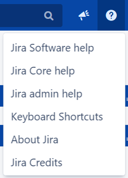

-   *Help:* Atlassian tarafından Jira ürününü kullanan kullanıcılara yönelik
    hazırlanmış dökümanlara kolay ulaşım açısından sağlanmış menü aracıdır.

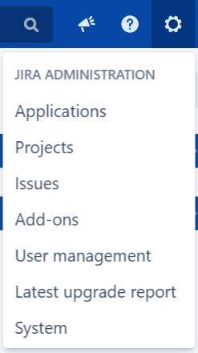

*Jira Administration:* Jiranızı yönetmenizi sağlar ve çok detaylı bir şekilde
işlemler gerçekleştirmenize yardımcı olur. Eğer yönetici(admin) değilseniz bu
menü altında çok daha kısıtlı elemanlar görüyor olacaksınız. Jiranızı diğer
CI-CD araçlarına entegre ederken bu menü üzerindeki elemanlar içerisinden
Add-ons şeceneği ile devam edilir. Yönetici değilseniz, yöneticinize başvurarak
bu tip olayların gerçekleştirilmesini sağlayabilirsiniz.

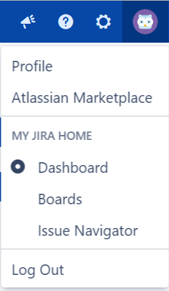

-   *User:* Temel kullanıcı işlemlerinizin yanında hızlıca size ait ögeleri
    özelleştirebileceğiniz menü elemanıdır.

Kurulum Esnasında Karşılaşılan Hatalar
--------------------------------------

Kurulum esnasında programı ilk defa Jirayı “localhost:8080” olarak tarayıcı da
açarken aşağıdaki hata ile karşılaşmıştım.

| Atlassian Plugins - JavaScript libraries (com.atlassian.plugin.jslibs) |
|------------------------------------------------------------------------|

Bu hata bilinen bir hata olmakla beraber kullanıcıların sunucu yada
bilgisayarlarının ana dilinin Türkçe olarak ayarlanmış olmasından kaynaklı
olduğu ortaya çıkması dahilinde

1.  Jira’nızı yüklemiş olduğunuz konum içerisindeki **\\Bin** klasörünü açınız,

2.  içerisinde bulunan **setenv.bat** dosyasını **Notepad** ile açınız,

3.  dosya içerisindeki **JVMSUPPORT_RECOMMENDED _ARGS=** yazan yeri bulunuz,

4.  aynı satırın devamına aşağıdaki parametreleri yapıştırabilirsiniz.

5.  kaydedip çıkınız.

| ```\-Duser.language=en -Duser.country=US -Duser.variant=US -Duser.timezone=Asia/Istanbul``` |
|---------------------------------------------------------------------------------------|


Sorununuz çözülecektir. Daha fazlası için aşağıdaki iki bağlantı üzerinden devam
edebilirsiniz:

-   <https://community.atlassian.com/t5/Questions/Jira-7-1-0-server-startup-error/qaq-p/105310>

-   <https://confluence.atlassian.com/adminjiraserver071/setting-properties-and-options-on-startup-802593108.html?_ga=2.253043209.1640962369.1539560497-1424128957.1539417023>

**S O N**
