SourceTree Nedir?
-----------------
Tanıtım
-------

SourceTree, Atlassian Inc. tarafından geliştirilen Git yönetimi üzerine
geliştirimiş bir masaüstü uygulamasıdır. SourceTree ile BitBucket, GitHub,
GitLab, Stash gibi diğer Git eko sistemleri üzerindeki Git Repository’lerinizi
yönetmeyi kolaylaştıran uygulamadır.

Amaçları
--------

SourceTree’nin en temel amaçları:
-   Git Kullanımını Kolaylaştırmak,
-   Repository Yönetimini Kolaylaştırmak,
-   Değişiklikleri Görselleştirmek,
-   Geliştirici Deneyimini Arttırmak

Artıları/Eksileri
-----------------

| Artıları | Eksileri                      |
|----------|-------------------------------|
| Bedava   | Piyasada yeni daha henüz v3.0 |
-   BitBucket ile harika entegrasyon
-   Yeni başlayanlar için basit
-   Uzmanlar için güçlü
-   Visual Studio Team Services Desteği
-   Mercurial Desteği

Rakipleri
---------

SourceTree’nin rakipleri oldukça fazla ve bu rakiplerin en başbelası olan iki
rakipten birisi GitHub Desktop ve diğeri de GitKraken. GitHub Desktop
popülaritesi ile ön plana çıkarken branchler için görselleştirme oluşturmaması
ve stash desteği vermemesi yüzünden biraz eksiye düşsede bu açıklarını
GitKraken’in oldukça iyi kapattığını ve SourceTree’ye çok büyük taş çıkardığını
belirtmek gerektir.

SourceTree Nasıl İndirilir ve Kurulur?
======================================

[İndirme Linki](https://product-downloads.atlassian.com/software/sourcetree/windows/ga/SourceTreeSetup-3.0.12.exe)
son sürümünü (3.0.12) indirebilirsiniz. MacOs ve Windows için ayrı sürümleri
bulunmaktadır. Bizler bu yazımızda Windows için uygun olanını indirip kuracağız
ve anlatacağız.

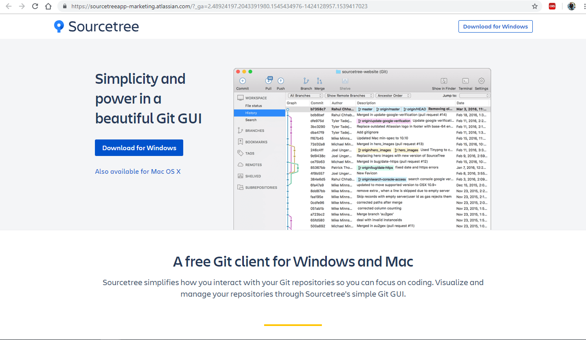

SourceTree’yi bilgisayarınıza kurabilmeniz için:

-   Windows OS için Windows 7+,
-   Mac OS X için 10.11+

ve üzeri versiyonlarını kullanmanız gerekmetedir.

Kurulum Aşamaları:

1.  İndirmiş olduğunu çalıştırılabilir dosyayı(Windows için .exe’yi MacOS için
    DMG’yi) çalıştırınız.

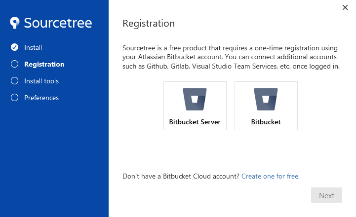

Sahip oluduğunuz olduğunuz Atlassian veya BitBucket hesabı ile kayıtlanmanız
gerekiyor. BitBucket Hesabım olduğu için sağdaki seçeneği seçtiğimde aşağıdaki
işlemler bütününü gerçekleştirmem gerekti.

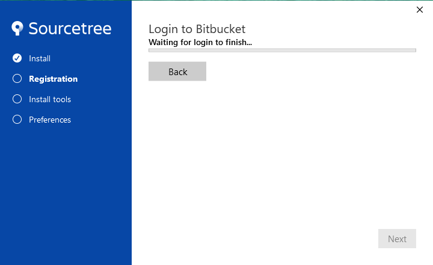

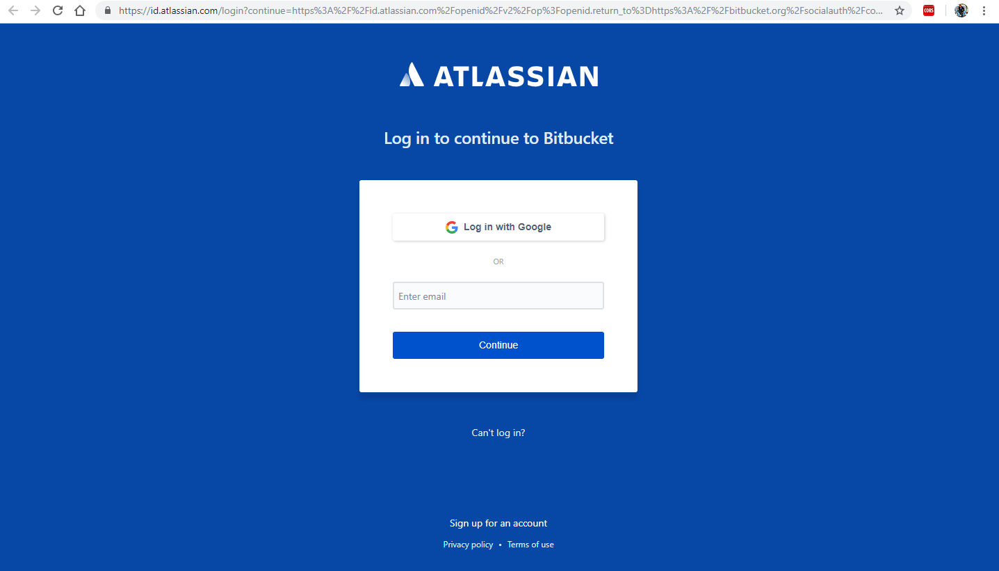

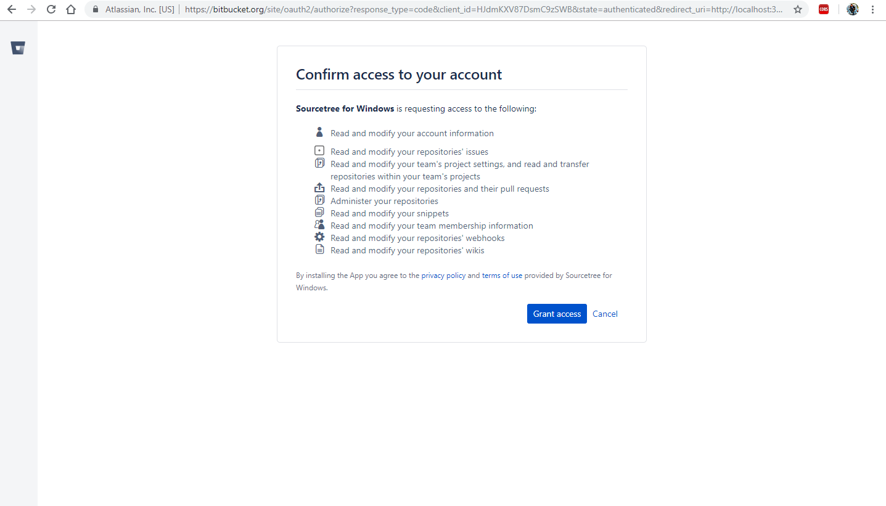

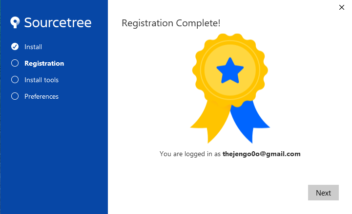

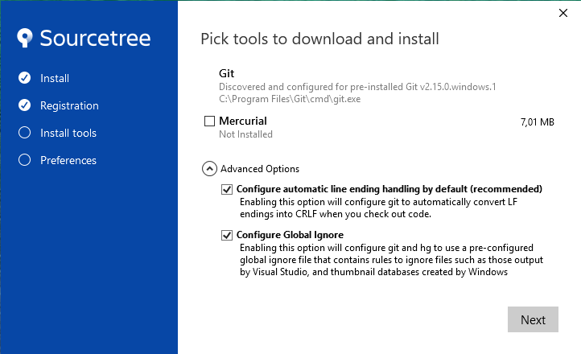

Bu ekranda gelişmiş ayarlar altındaki CRLF gelen kod içerisindeki satır
sonlarını otomatik anlamlandırması için seçilmiştir. Diğer seçenek iste genel
geçer olarak bazı dosyalar vardır görmezden gelinebilecek ve her işletim sistemi
kullanıcısına özel olarak dinamik bir şekilde üretilenler gibi.

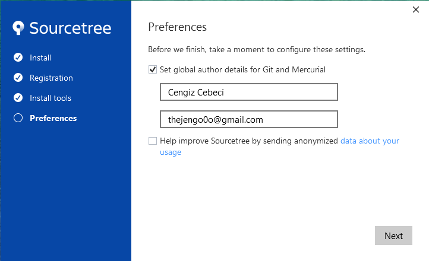

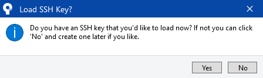

Ben BitBucket hesabımı Remote olarak eklediğin için bu ekran NO diyerek
geçiyorum başka bir zaman ihtiyaç dahilinde SourceTree içerisinde bir tane
generate edebiliriz.

SourceTree Nasıl Kullanılır?
----------------------------
SourceTree Uygulamasını Tanıyalım
---------------------------------

SourceTree üzerinde her şey oldukça basit ve doğru bir şekilde konumlandırılmış
olduğu için erişimi ve kullanımı kolaydır.

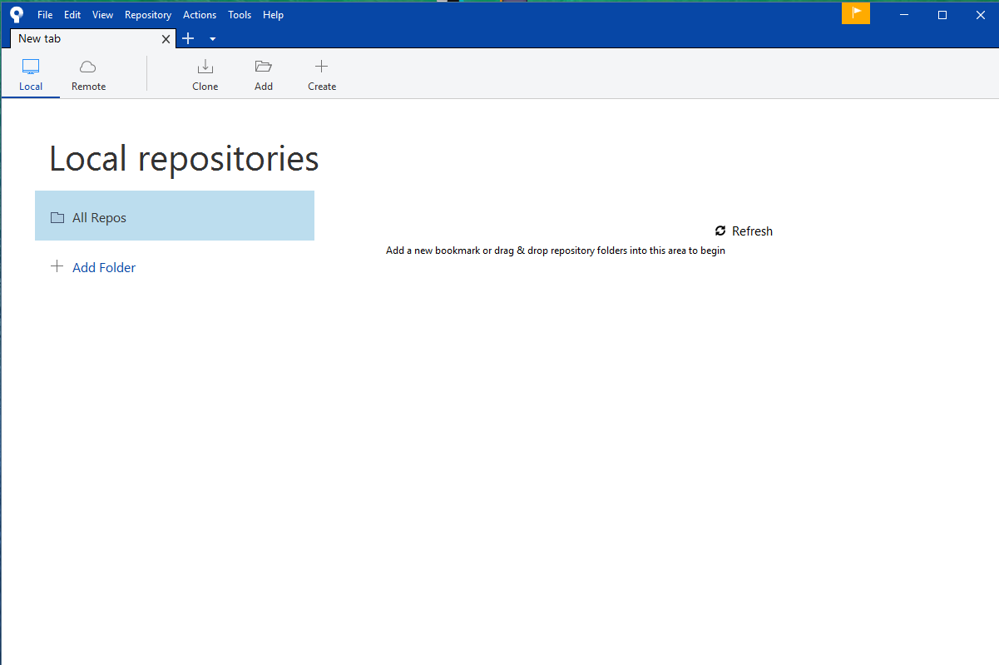

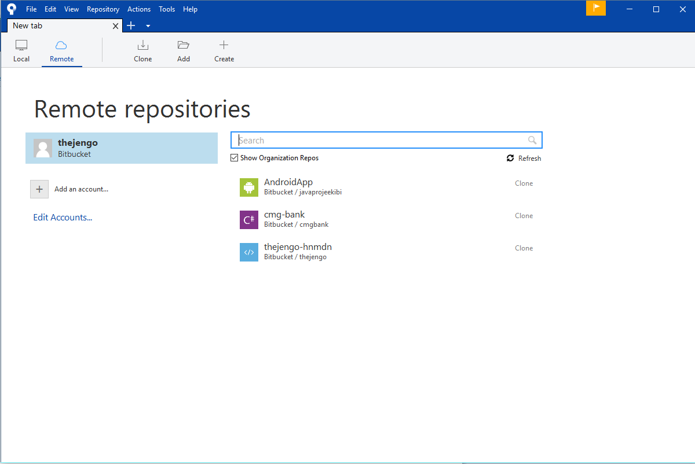

Bu ekran üzerinde bağlanmış olduğunu Git hesaplarına(BitBucket, GitHub, GitLab,
Stash vs.) ait repoları görüntülüyor olacaksınız. Seçtiğiniz repoları kolayca
bilgisayarınıza clonelayabilir üzerinde çalışabilir ve git işlemlerini
gerçekleştirebilirsiniz.

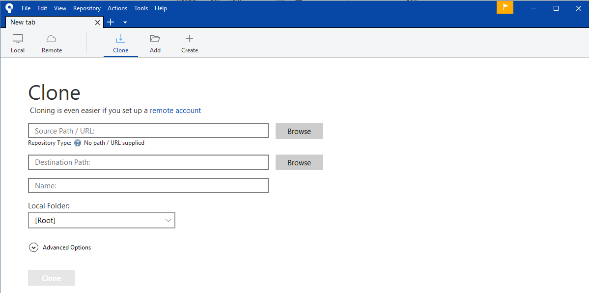

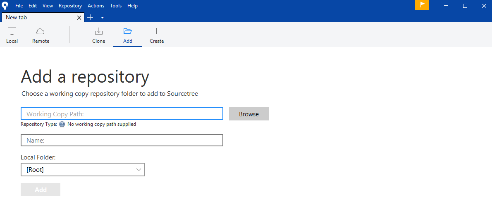

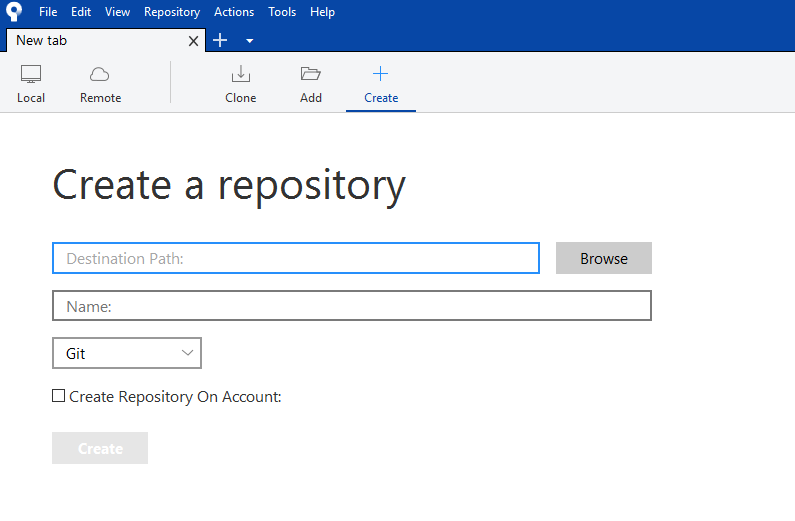

Ayrıca başka repolarıda kolayca klonlayabilir, bilgisayarınızdakileri
ekleyebilir, yeni bir tane oluşturabilir ve kullanabilirsiniz.

Bir Repo Clone’layalım
----------------------

Eğer Remote olarak bağlandıysanız tek yapmanız gereken *Remote*’ta bulunan
reponuzu’ı içerisinden seçmek ve devam etmek. Daha sonra *Clone Tab*’ı
içerisindeki alanların otomatik bir şekilde doldurulmuş olduğunu göreceksiniz.
Eğer giriş işlemleriniz yapılmamışsa BitBucket, GitHub veya GitLab hesap
bilgilerinizi girmeniz istenecektir. Bu bilgileri ve aşağıdaki gibi bir ekran
sizleri karşılayacaktır. Giriş işlemlerinin ardından aşağıda aktif olmayan
“**Clone**” düğmesi aktif olacak ve klonlama işlemlerinize devam edebileceksiniz.

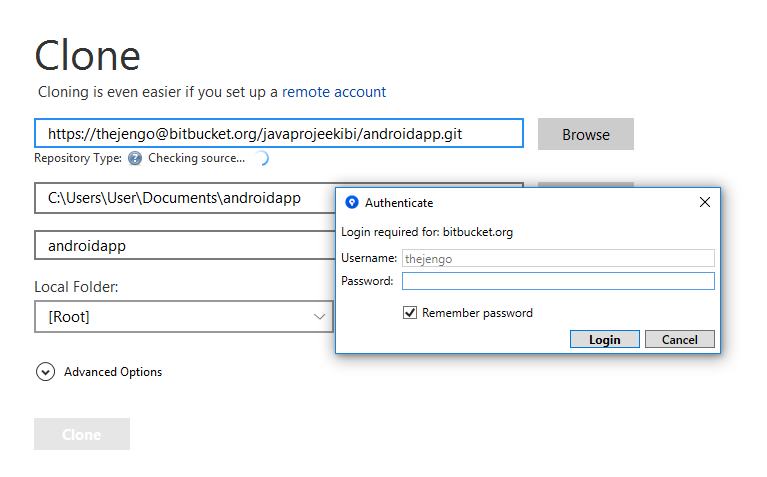

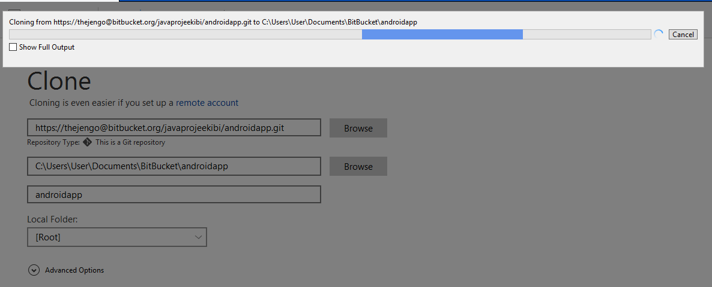

Repo Yönetimi
-------------

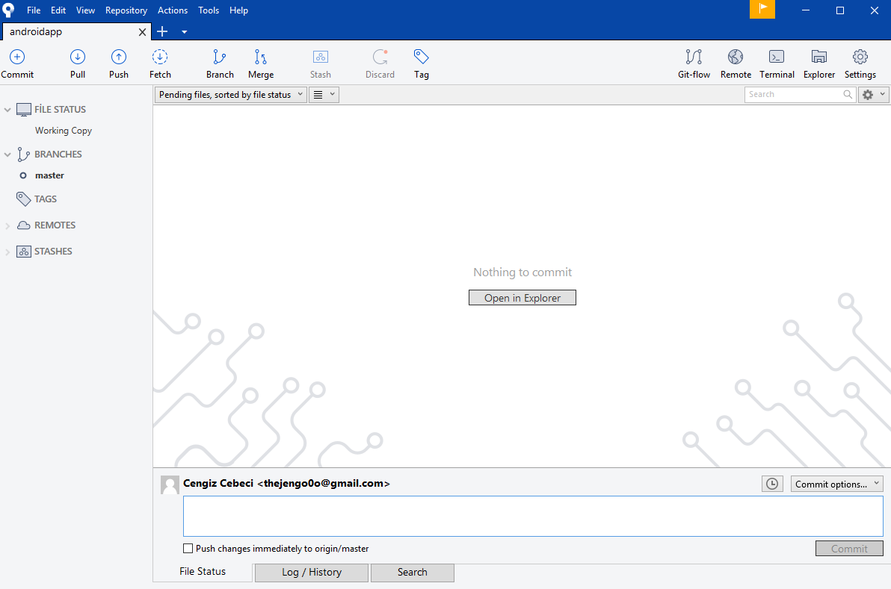

Bu ekran içerisinden Commit atabilir, kodlarınızı stashleyebilir, branchlerinizi
yönetebilir veya görüntüleyebilir, diğer commitleri, pull veya fetch edebilir,
branch ve merge işlemleri yapabilirsiniz. Kısacası ihtiyacınız olan tüm git
işlemlerini gerçekleştirebilirsiniz.

İşlemleri tanıyalım
-------------------

Proje/Repo ekranı sekmesi içerisinde bulunan üst menü düğmeleri ve işlevleri
yanlarında aşağıdaki tabloda verilmiştir.

| [Commit Düğmesi](./media/m1.png) | Göndermek üzere hazırlamış olduğunuz kodlar/dosyalar paketidir.                                                                                                                |
|--------------------------------------------|--------------------------------------------------------------------------------------------------------------------------------------------------------------------------------|
| [Pull Düğmesi](./media/m2.png) | Repo üzerinde başkaları tarafından değişiklik yapılmış kodların/dosyaların aktarılması.                                                                                        |
| [Push Düğmesi](./media/m3.png) | Hazırlanmış commit paketinin Repo’ya aktarılmasıdır.                                                                                                                           |
| [Fetch Düğmesi](./media/m4.png) | Repodaki tüm içeriği yakalar ve getirir.                                                                                                                                       |
| [Branch Düğmesi](./media/m5.png) | Yeni bir dallanma oluşturmaya veya silmeye yarar.                                                                                                                              |
| [Merge Düğmesi](./media/m6.png) | Dallandırılmış kodları/dosyaları/projeleri birleştirir.                                                                                                                        |
| [Stash Düğmesi](./media/m7.png) | Göndermek istemediğiniz kendinize sakladığınız ya da hazır olmayan kod parçacıkları/dosyalarınızdır.                                                                           |
| [Discard Düğmesi](./media/m8.png) | Yaptığınız değişiklikleri bir önceki branch noktasına geri alır.                                                                                                               |
| [Tag Düğmesi](./media/m9.png) | Commitinize etiket eklemenizi veya silmenizi sağlar.                                                                                                                           |
| [Git-Flow Düğmesi](./media/m10.png) | Git branchlerinizi yönetmeye yarar, Yeni Bir Özellik, Yeni Bir Versiyon Yayınlama, Hotfix veya Diğer Aksiyonlarınızı yönetmeye yarayan çok kullanışlı ve güzel bir özelliktir. |
| [Remote Düğmesi](./media/m11.png) | Reponuzun Remote’taki konumunu tarayıcınız üzerinde açar.                                                                                                                      |
| [Terminal Düğmesi](./media/m12.png) | Git terminalinizi açar.                                                                                                                                                        |
| [Explorer Düğmesi](./media/m13.png) | Reponuzun dosya konumunu açar.                                                                                                                                                 |
| [Settings Düğmesi](./media/m14.png) | Repo ve Repo üzerindeki yönetim ayarlarınızı açar.                                                                                                                             |

Commit ve Push İşlemi
---------------------

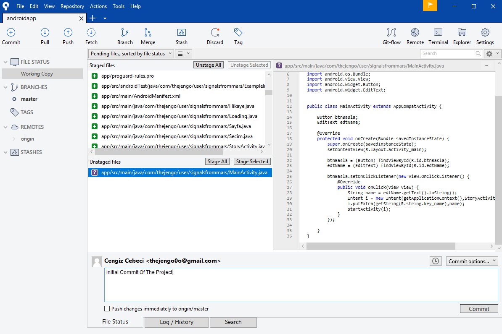

Unstaged dosyalarınızı yöneterek projemizin dosyalarında yaptığımız değişikleri
commit edebiliriz.

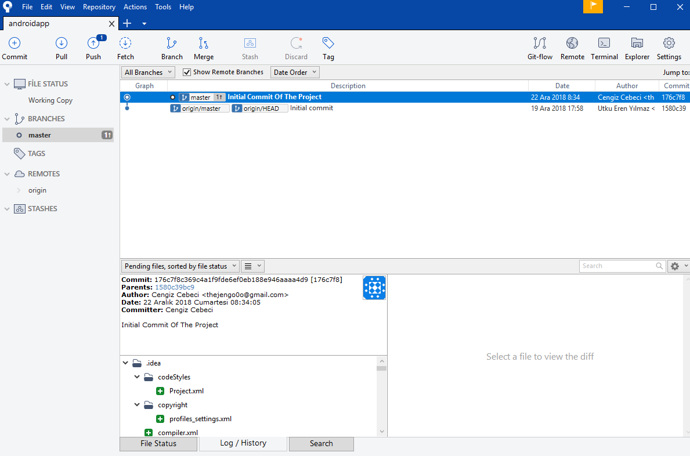

Sağ alttaki *Commit* düğmesine bastıktan sonra commitimiz loglanır ve branchine
ait olan yere düşer ve buradan branch ve master seçimi yapılarak *Push* etmeye
hazır hale gelir buradan sonra yapılacak tek şey yukarıdaki *Push* düğmesine
basmak olacaktır ve ta da kodunuz Reponuza *Push* edilmiş olacaktır.

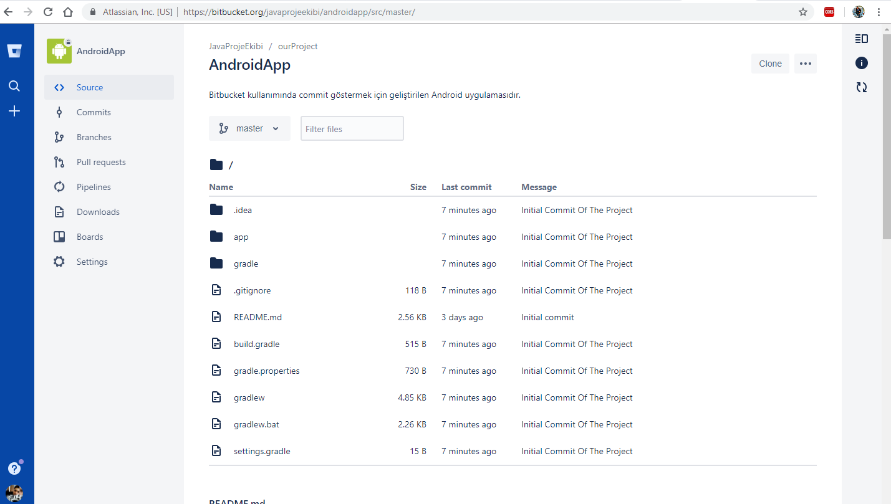

Gördüğünüz gibi her şey işte bu kadar basit projemize dair kodlarımız sisteme
yüklenmiş ve diğer proje üyeleri tarafından ulaşılabilir hale gelmiş
bulunmaktadır. Bu noktadan sonra SourceTree ile yapacağınız tüm işlemler
sizlerin Git yeteneklerinize/bilgilerinize kalmıştır.

**S O N**